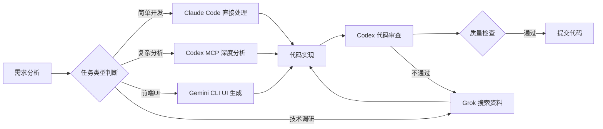

## 📊 业务价值分析

### 核心价值体现

#### 1️⃣ 交易决策价值

> [!success] 数据驱动的智能决策
> 通过机器学习模型和大数据分析，为土地交易提供科学决策支持

| 价值维度 | 实现方式 | 业务影响 |
|---------|---------|---------|
| **价格预测模型** | 历史成交数据 + 地段特征 → 土地估值模型 | 提高估值准确度 20-30% |
| **投资热点识别** | 交易频率 + 价格趋势 → 区域投资价值分析 | 发现潜力区域，降低投资风险 |
| **供需匹配** | 买方需求画像 + 卖方土地特征 → 精准推荐 | 提升成交转化率 15-25% |

#### 2️⃣ 市场洞察价值

> [!info] 宏观趋势把握
> 从土地交易数据中洞察城市发展和政策影响

- **区域发展趋势**
  - 土地交易数据反映城市规划和经济发展方向
  - 识别新兴商圈和产业集群
  - 预测区域价值增长潜力

- **政策影响分析**
  - 政策变化对土地交易的即时影响数据
  - 量化政策效果（如限购、税收调整）
  - 辅助政策响应决策

- **竞品分析**
  - 跨平台数据对比，了解市场份额和竞争态势
  - 识别竞争优势和差异化机会
  - 制定针对性竞争策略

#### 3️⃣ 用户行为价值

> [!tip] 用户洞察驱动产品优化
> 通过用户行为数据优化产品体验和服务


- **搜索行为分析**
  - 用户关注的地段、面积、价格区间
  - 热门搜索词和趋势变化
  - 个性化推荐算法优化

- **浏览路径分析**
  - 从搜索到成交的转化漏斗分析
  - 识别流失节点和优化机会
  - A/B 测试验证优化效果

- **决策周期分析**
  - 不同类型土地的平均决策时间
  - 影响决策速度的关键因素
  - 缩短决策周期的干预策略

---

### ⚠️ 当前数据问题与解决方案

#### 问题 1：地号更新不及时

> [!warning] 数据时效性问题
> 地号数据滞后影响业务准确性

| 维度 | 详情 |
|-----|------|
| **现状** | 土地新增和废弃的地号一直都没更新<br>上一次更新时间：2025 年 3 月 |
| **影响** | 用户搜索不到新地号，废弃地号仍显示<br>影响用户体验和数据准确性 |
| **解决方案** | ✅ 已找到自动化维护方案<br>⏱️ 新增/废弃地号 1 周内更新 |
| **预期效果** | 数据时效性提升 90%+<br>用户投诉率下降 50%+ |

#### 问题 2：图资更新滞后

> [!warning] 高价值数据未充分利用
> 2025 年新增图资未及时整合

| 维度 | 详情 |
|-----|------|
| **现状** | 2025 年新增大量高价值图资<br>图层数据未考虑更新 |
| **影响** | 缺失关键地理信息<br>影响估值模型准确度 |
| **规划** | 📅 H1 完成图资更新<br>🔄 建立实时更新机制 |
| **预期效果** | 估值准确度提升 15-20%<br>用户决策信心增强 |

---

## 🤖 AI 实践工作流

> [!abstract] 核心理念
> 构建 AI 辅助的高效知识管理和开发工作流，提升个人和团队生产力

---

### 1️⃣ Obsidian + Claudian：知识管理中枢

> [!info] 什么是 Obsidian？
> **Obsidian** 是一款强大的本地优先知识管理工具，基于 Markdown 文件构建你的"第二大脑"。
>
> **核心特点**：
> - 📝 **纯文本存储**：所有笔记都是 Markdown 文件，永久可访问，不被平台绑架
> - 🔗 **双向链接**：通过 `[[wikilinks]]` 建立笔记之间的关联，形成知识网络
> - 🎨 **Canvas 画布**：可视化展示概念关系，构建思维导图和知识图谱
> - 🔌 **插件生态**：丰富的社区插件，支持 Web Clipper、Git 同步、AI 集成等
> - 🏠 **本地优先**：数据完全掌控在自己手中，支持多端同步
> - 🎯 **高度可定制**：主题、CSS、插件，打造个性化知识管理系统
>
> **为什么选择 Obsidian？**
> - ✅ 适合长期知识积累（10年、20年的知识库）
> - ✅ 支持复杂的知识网络构建（非线性思维）
> - ✅ 与 AI 工具完美结合（Claude、Gemini 等）
> - ✅ 开发者友好（支持代码块、Mermaid 图表等）

> [!success] 效率提升：**文档整理速度提升 3-5 倍**

#### 核心功能

| 功能              | 工具                       | 应用场景         | 效率提升 |
| --------------- | ------------------------ | ------------ | ---- |
| **快速文档整理**      | [[Claude Code]]          | 会议记录、技术文档结构化 | 5x   |
| **一键内容导入**      | [[Obsidian Web Clipper]] | 技术文章、研究报告收集  | 10x  |
| **对话内容归档**      | Gemini 对话导出              | AI 对话转知识沉淀   | 3x   |
| **Markdown 优化** | Claudian Skills          | 格式美化、结构优化    | 4x   |
| **可视化理解**       | Canvas 生成                | 复杂概念关系图谱     | 深度理解 |

#### 最佳实践

> [!tip] 知识管理工作流
> 1. **收集**：Web Clipper 一键保存 → 自动分类到 Inbox
> 2. **处理**：Claude Code 结构化整理 → 添加标签和链接
> 3. **沉淀**：定期回顾 → 生成 Canvas 加深理解
> 4. **应用**：通过 wikilinks 建立知识网络 → 快速检索

#### 推荐插件组合

- **Dataview**：数据库式查询笔记
- **Templater**：模板自动化
- **Omnisearch**：AI 增强搜索（[参考](https://www.newsminimalist.com/articles/omnisearch-plugin-enhances-obsidians-search-capabilities-e4b68b35)）
- **Smart Connections**：语义关联推荐

---

### 2️⃣ Serena MCP：智能代码助手

> [!success] 效率提升：**代码定位速度提升 5-10 倍，Token 消耗降低 40-60%**

#### 核心优势

> [!info] 技术原理
> Serena MCP 通过集成 JetBrains IDE 的语言服务器协议（LSP），实现语义级代码理解，而非简单的文本匹配

```yaml
功能特性:
  - JetBrains IDE 深度集成（LSP 支持）
  - 语义级代码理解（非文本匹配）
  - 符号级精准定位（函数/类/变量）
  - 项目记忆持久化（跨会话保持上下文）

性能对比:
  Claude Code + grep 命令:
    原理: 文本模式匹配
    速度: 基准
    准确度: 60-70%（误报率高）
    Token 消耗: 高（需要读取大量文件）

  Serena MCP + JetBrains IDE:
    原理: 语义级符号理解
    速度: 5-10x（直接定位）
    准确度: 90-95%（精准匹配）
    Token 消耗: -40~60%（只读取相关代码）
```

#### 典型应用场景对比

| 场景 | Claude Code + grep | Serena MCP + JetBrains IDE | 效率对比 |
|-----|-------------------|---------------------------|---------|
| **查找函数定义** | `grep -r "function_name"` → 手动筛选结果 | `jet_brains_find_symbol` → 直接跳转定义 | 10x |
| **追踪函数调用** | `grep -r "function_name"` → 逐文件查看 | `jet_brains_find_referencing_symbols` → 依赖图谱 | 8x |
| **了解文件结构** | 手动阅读代码 → 理解类和方法 | `jet_brains_get_symbols_overview` → 一键获取结构 | 5x |
| **分析继承关系** | 手动追踪 extends/implements | `jet_brains_type_hierarchy` → 可视化层次结构 | 6x |
| **重构代码** | `grep` + 手动替换 → 容易遗漏 | `rename_symbol` → 全局符号级重命名 | 5x |
| **Bug 定位** | 文本搜索 + 打断点调试 | 语义搜索 → 快速跳转相关代码 | 3x |

**关键差异**：
- ✅ **grep**：文本匹配，会找到注释、字符串中的匹配（噪音多）
- ✅ **Serena MCP**：符号级理解，只匹配实际的代码符号（精准）

#### 实际使用对比示例

> [!example] 场景：查找 `getUserData` 函数的所有调用位置

**传统方式（Claude Code + grep）**：
```bash
# 1. 使用 grep 搜索
grep -r "getUserData" src/

# 结果包含大量噪音：
# - 注释中的 "getUserData"
# - 字符串中的 "getUserData"
# - 变量名 "getUserDataService"
# - 需要手动筛选 50+ 个结果

# 2. 逐个文件打开查看上下文
# 3. 手动判断哪些是真正的函数调用
# ⏱️ 耗时：15-20 分钟
```

**Serena MCP 方式（JetBrains 集成）**：
```bash
# 1. 激活项目
mcp__serena__activate_project

# 2. 查找符号定义（JetBrains IDE 集成）
mcp_serean_jet_brains_find_symbol("getUserData")
# → 直接定位到 src/services/user.ts:45
# → 显示函数签名和文档

# 3. 查找所有引用（JetBrains IDE 集成）
mcp_serean_jet_brains_find_referencing_symbols("getUserData", "src/services/user.ts")
# → 返回 8 个精准的调用位置（无噪音）
# → 自动显示调用上下文和依赖关系
# → 按文件分组展示

# ⏱️ 耗时：1-2 分钟
```

**效率提升**：**10x** ⚡

#### 高级应用示例

> [!example] 场景：重构一个复杂的类继承体系

**任务**：需要重构 `BaseService` 类，了解它的所有子类和使用情况

```bash
# 1. 激活项目
mcp__serena__activate_project

# 2. 获取 BaseService 的符号概览
mcp_serean_jet_brains_get_symbols_overview("src/services/BaseService.ts")
# 输出：
# - class BaseService
#   - constructor()
#   - protected init()
#   - public execute()
#   - private validate()

# 3. 查看类型层次结构
mcp_serean_jet_brains_type_hierarchy("BaseService", "src/services/BaseService.ts")
# 输出：
# BaseService (父类)
# ├── UserService (子类)
# ├── OrderService (子类)
# └── PaymentService (子类)

# 4. 查找 execute 方法的所有引用
mcp_serean_jet_brains_find_referencing_symbols("execute", "src/services/BaseService.ts")
# 输出：8 个调用位置，按文件分组

# 5. 安全重命名方法
mcp__serena__rename_symbol("execute", "src/services/BaseService.ts", "run")
# → 自动更新所有子类和调用位置

# 6. 保存重构记忆
mcp__serena__write_memory("refactor_base_service", "重构完成，execute → run，影响 3 个子类和 8 个调用点")
```

**传统方式耗时**：2-3 小时
**Serena MCP 耗时**：15-20 分钟
**效率提升**：**8x** 🚀

#### 最佳实践

> [!tip] 代码导航工作流（JetBrains 集成）
> 1. **项目激活**：`mcp__serena__activate_project` 加载项目上下文
> 2. **符号搜索**：`mcp_serean_jet_brains_find_symbol` 精准定位函数/类
> 3. **引用追踪**：`mcp_serean_jet_brains_find_referencing_symbols` 查看调用关系
> 4. **符号概览**：`mcp_serean_jet_brains_get_symbols_overview` 快速了解文件结构
> 5. **类型层次**：`mcp_serean_jet_brains_type_hierarchy` 查看继承关系
> 6. **记忆沉淀**：`write_memory` 保存重要发现
> 7. **符号重构**：`rename_symbol` 安全重命名（自动更新所有引用）

#### JetBrains 集成工具完整列表

| 工具 | 功能 | 使用场景 |
|-----|------|---------|
| `jet_brains_find_symbol` | 查找符号定义 | 快速定位函数/类/变量定义位置 |
| `jet_brains_find_referencing_symbols` | 查找符号引用 | 追踪函数调用、变量使用位置 |
| `jet_brains_get_symbols_overview` | 获取符号概览 | 了解文件整体结构（类、方法、属性） |
| `jet_brains_type_hierarchy` | 查看类型层次结构 | 分析类继承关系、接口实现 |

---

### 3️⃣ Claude Code + Codex + Gemini CLI + Grok：多模型协同

> [!success] 效率提升：**开发效率提升 2-3 倍，代码质量提升 30-40%**

#### 核心工具特点

| 工具 | 核心能力 | 最佳使用场景 |
|------|---------|-------------|
| **Claude Code** | 代码理解与生成 | 日常开发、代码重构、问题解决 |
| **Codex MCP** | 深度代码分析 | 复杂架构分析、代码审查 |
| **Gemini CLI** | UI 生成与前端 | 前端界面快速生成 |
| **Grok** | 搜索能力显著，受限制少 | 快速获取技术资料、最新文档查询 |

#### 协同架构



#### 工具分工

| 工具 | 擅长领域 | 使用场景 | MCP 集成 |
|-----|---------|---------|---------|
| **Claude Code** | 通用开发、文档 | 日常开发、重构 | ✅ 主控制器 |
| **Codex** | 复杂算法、审查 | 算法实现、代码审查 | ✅ MCP 调用 |
| **Gemini CLI** | 前端、多模态 | UI 开发、图像处理 | ✅ MCP 调用 |

#### SuperClaude 提示词系统

> [!info] 内置专家级提示词
> SuperClaude 插件提供 50+ 专业提示词模板，覆盖开发全流程

**核心提示词类别**：
- `/sc:analyze` - 代码分析（质量、安全、性能）
- `/sc:improve` - 代码优化（重构、性能、可读性）
- `/sc:implement` - 功能实现（TDD、最佳实践）
- `/sc:troubleshoot` - 问题诊断（Bug 定位、性能分析）
- `/sc:research` - 技术调研（深度研究、对比分析）

**实践经验**：
- ✅ 使用专业提示词比直接描述问题效果提升 **40-60%**
- ✅ 结构化输出更易理解和执行
- ✅ 减少来回沟通次数 **50%+**

#### 开发工作流示例

```bash
# 1. 需求分析
/sc:brainstorm "实现用户认证系统"

# 2. 架构设计
/sc:design "JWT + Redis 会话管理"

# 3. 代码实现（复杂逻辑）
通过 Codex MCP 实现核心算法

# 4. 前端开发
通过 Gemini MCP 生成 UI 组件

# 5. 代码审查
/sc:analyze --focus security,performance

# 6. 优化改进
/sc:improve --focus maintainability
```

---

### 4️⃣ Pencli：AI 驱动的设计开发一体化

> [!success] 效率提升：**UI 开发速度提升 5-10 倍，设计还原度 95%+**

#### 核心特性

| 特性 | 说明 | 价值 |
|-----|------|------|
| **无限画布** | 自由布局设计空间 | 激发创意，快速原型 |
| **零门槛设计** | 人人都是 UI 设计师 | 降低设计门槛 |
| **精准调整** | 像素级组件控制 | 专业级设计质量 |
| **代码生成** | UI 设计 → 前端代码 | 像素级复制，即改即用 |
| **多模型支持** | Gemini CLI / Codex / Claude Code | 灵活选择最优模型 |
| **MCP 集成** | 无缝工作流集成 | 一站式开发体验 |

#### 设计开发工作流


#### 最佳实践

> [!tip] 高效 UI 开发流程
> 1. **快速原型**：在 Pencli 画布上拖拽组件，5 分钟完成原型
> 2. **实时调整**：与产品/设计师实时协作，即时修改
> 3. **代码生成**：选择目标框架（React/Vue/Angular），一键生成
> 4. **AI 优化**：通过 MCP 调用 AI 优化代码结构和性能
> 5. **项目集成**：复制代码到项目，微调后即可使用

#### 支持的技术栈

- **前端框架**：React, Vue, Angular, Svelte
- **样式方案**：Tailwind CSS, CSS Modules, Styled Components
- **组件库**：Material-UI, Ant Design, Chakra UI
- **AI 模型**：Gemini CLI（推荐前端）, Codex, Claude Code

---

## 📈 效率提升总结

> [!success] 整体效能提升
> 通过 AI 工具链协同，实现开发效率质的飞跃

| 工作环节 | 传统方式耗时 | AI 辅助耗时 | 效率提升 |
|---------|------------|-----------|---------|
| **文档整理** | 2 小时 | 30 分钟 | **4x** |
| **代码定位** | 30 分钟 | 3 分钟 | **10x** |
| **代码审查** | 1 小时 | 20 分钟 | **3x** |
| **UI 开发** | 4 小时 | 40 分钟 | **6x** |
| **技术调研** | 3 小时 | 45 分钟 | **4x** |
| **Bug 修复** | 2 小时 | 40 分钟 | **3x** |

**综合效率提升**：**3-5 倍** 🚀

---

## 🔗 相关资源

### MCP 生态
- [Integrating MCP Servers for Web Search with Claude Code](https://intuitionlabs.ai/articles/mcp-servers-claude-code-internet-search)
- [构建 MCP 服务器用于网络爬取：分步指南](https://www.bright.cn/blog/ai/web-scraping-with-mcp)
- [Real-time Web Search for AI Assistants](https://www.mcplane.com/mcp_servers/web-search-6)

### Obsidian AI 增强
- [Obsidian Guide for Researchers - AI and MCP Integration](https://lab.nounai-librarian.com/obsidian2-2/)
- [How to Make Your Obsidian Notes Searchable with AI](https://needle.app/blog/how-to-make-obsidian-notes-searchable)
- [Omnisearch plugin enhances Obsidian's search capabilities](https://www.newsminimalist.com/articles/omnisearch-plugin-enhances-obsidians-search-capabilities-e4b68b35)

---

## 📝 下一步行动

> [!todo] 待办事项
> - [ ] 完成地号自动更新系统部署（Q1）
> - [ ] 整合 2025 年新增图资数据（H1）
> - [ ] 优化 Obsidian 知识库结构
> - [ ] 建立团队 AI 工具使用规范
> - [ ] 编写 MCP 集成最佳实践文档

---

*最后更新：2026-01-27*
*标签：#业务分析 #AI工具链 #知识管理 #开发效率*
