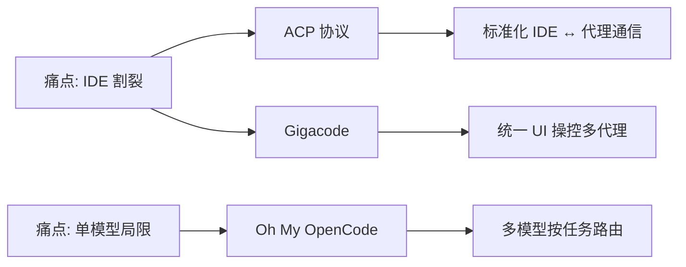
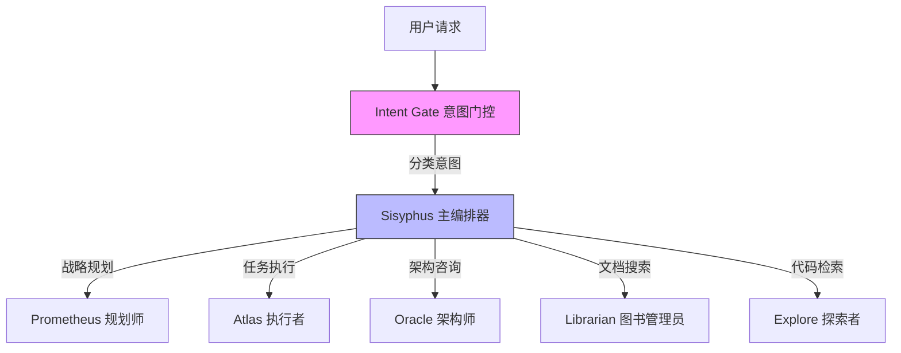
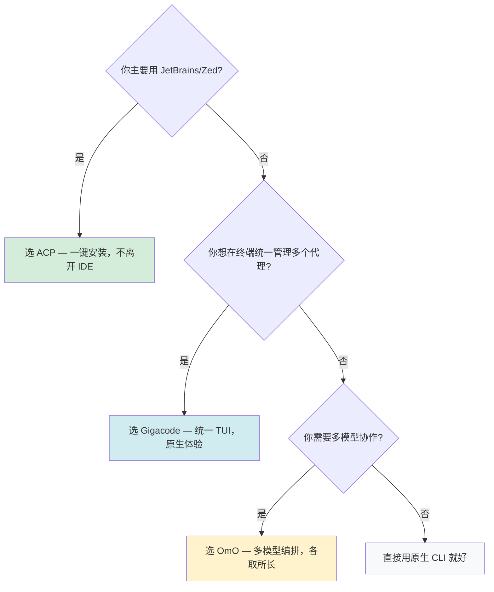

# AI 编码代理的三种集成路线：ACP、Gigacode 与 Oh My OpenCode

> [!abstract] TL;DR
> 三种方案解决不同层面的问题：
> - **ACP** = 通信协议，让任意代理接入任意 IDE（类比 LSP）
> - **Gigacode** = UI 壳，用统一界面操控不同代理的原生 CLI
> - **Oh My OpenCode** = 编排框架，多个模型组队按任务分工协作
>
> 它们不互斥，可以在不同层面组合使用。

## 一、核心概念速查

在深入之前，先对齐几个关键概念：

| 概念 | 含义 | 类比 |
|------|------|------|
| **编码代理**（Coding Agent） | 能自主读写代码、执行命令的 AI 程序，如 Claude Code、Codex CLI、Amp | 一个会写代码的 AI 助手 |
| **代理循环**（Agent Loop） | 代理的核心运行机制：接收指令 → 思考 → 调用工具 → 观察结果 → 继续思考… | 人类的"想-做-看-再想"循环 |
| **系统提示词** | 预置在代理内部的指令，定义其行为边界和能力 | 代理的"岗位说明书" |
| **工具链** | 代理可调用的内置工具集，如文件读写、终端命令、代码搜索等 | 代理的"工具箱" |
| **TUI** | 终端用户界面（Terminal UI），在终端中运行的图形化界面 | 终端里的"小程序" |
| **编排**（Orchestration） | 协调多个代理/模型协同工作，按任务类型分配最合适的执行者 | 项目经理分配任务给不同工程师 |

## 二、背景：为什么需要"集成"？

当前主流编码代理（Claude Code、Codex CLI、Amp、Goose 等）大多以终端 CLI 形式存在。它们各自拥有精心调优的系统提示词、专用工具链和代理循环逻辑，编码能力很强——但存在两个核心痛点：

> [!warning] 痛点一：IDE 割裂
> 开发者需要在 IDE 和终端之间频繁切换，上下文断裂。你在 IDE 里看着代码，却要切到终端告诉 AI 该改哪里。

> [!warning] 痛点二：单模型局限
> 每个代理绑定特定模型。但现实是：Claude 擅长编码、Gemini 擅长前端、GPT 擅长推理——没有一个模型在所有任务上都是最优解。

围绕这两个痛点，社区演化出了三条不同的技术路线：



## 三、ACP：协议层标准化

> [!tip] 一句话理解
> ACP 就是 AI 编码代理领域的 LSP——定义了 IDE 和代理之间"怎么对话"的标准协议。

### 3.1 什么是 ACP

ACP（Agent Client Protocol）是 JetBrains 和 Zed 联合开发的开放协议。就像 LSP（Language Server Protocol）让任意编辑器接入任意语言服务器一样，ACP 标准化了 **IDE 与 AI 编码代理之间的通信接口**。

核心价值：**M × N → M + N**

- 没有 ACP：5 个 IDE × 10 个代理 = 需要 50 个定制集成
- 有了 ACP：5 个 IDE + 10 个代理 = 只需 15 个适配实现

```
┌─────────────┐                  ┌──────────────┐
│  JetBrains  │                  │  Claude Code  │
│  Zed        │ ◄── ACP 协议 ──► │  Codex CLI    │
│  其他 IDE   │                  │  Goose / Amp  │
└─────────────┘                  └──────────────┘
   任意客户端         标准接口         任意代理
```

### 3.2 Claude Code 如何通过 ACP 接入 JetBrains

Claude Code 本身不直接实现 ACP，而是通过 Zed 开发的适配器 **claude-agent-acp** 来桥接：

```
JetBrains IDE ←→ ACP 协议 ←→ claude-agent-acp 适配器 ←→ Claude Agent SDK
                                                          （内含 Claude Code 引擎）
```

> [!info] Claude Agent SDK ≠ 阉割版
> Claude Agent SDK 是 Claude Code CLI 的底层引擎的编程接口。系统提示词、内置工具链（Read/Write/Bash 等）、代理循环逻辑都完整保留。适配器只是在外面包了一层 ACP 通信协议。

### 3.3 两种接入方式

**方式一：ACP Registry 一键安装（推荐）**

2026 年 1 月，JetBrains 上线了 ACP Agent Registry，可直接在 IDE 内安装：

1. 打开 AI Chat → 下拉菜单 → "Install From ACP Registry"
2. 找到 Claude Agent，点击安装
3. IDE 自动下载代理文件和运行时
4. 首次使用时输入 API Key 认证

**方式二：手动配置 acp.json**

先安装适配器：`npm install -g @zed-industries/claude-agent-acp`

编辑 `~/.jetbrains/acp.json`：

```json
{
    "default_mcp_settings": {
        "use_idea_mcp": true,
        "use_custom_mcp": true
    },
    "agent_servers": {
        "Claude Agent": {
            "command": "claude-agent-acp",
            "args": []
        }
    }
}
```

### 3.4 支持的功能

通过 ACP 接入后，Claude Agent 在 JetBrains IDE 中支持：

- 上下文 @-mentions 和图片输入
- 工具调用（带权限请求）
- 文件编辑审查
- TODO 列表和交互式终端
- 自定义 Slash 命令
- MCP 服务器透传

### 3.5 局限性

- 不支持 WSL 环境
- Claude Code CLI 的部分交互特性（如 `/compact`、hooks 系统、上下文压缩策略）在 ACP 桥接后可能不完全一致
- JetBrains 官方也承认："在应用标准的同时，我们牺牲了一些定制化功能"

### 3.6 ACP 生态现状

| 角色 | 已支持 |
|------|--------|
| 代理端 | Claude Code、Codex CLI、GitHub Copilot（公测）、Gemini CLI、Goose、Kiro CLI、OpenCode、Cline、Amp 等 20+ 个 |
| 客户端 | JetBrains 全系 IDE、Zed |

## 四、Gigacode：代理进程的 UI 壳

> [!tip] 一句话理解
> Gigacode 不改变任何代理的行为，只是给不同代理的 CLI 套上同一个好看的界面。

### 4.1 核心思路

Gigacode 是 Rivet 团队基于 Sandbox Agent SDK 开发的实验性工具。思路很直接：**用 OpenCode 的 TUI 界面去操控任意编码代理的 CLI 进程**。

你可以把它理解为一个"万能遥控器"——遥控器的按钮和界面是统一的，但背后连接的可以是不同品牌的设备。

```
┌─ Gigacode ──────────────────────────────────────────────────┐
│                                                              │
│  OpenCode TUI 界面  ──▶  Sandbox Agent SDK  ──▶  底层代理   │
│  （统一的交互体验）      （进程管理层）          │            │
│                                                 ├ Claude Code│
│                                                 ├ Codex CLI  │
│                                                 ├ Amp        │
│                                                 └ ...        │
└──────────────────────────────────────────────────────────────┘
```

### 4.2 关键特点：原汁原味

Gigacode 强调**零侵入**——它不改变底层代理的任何行为，只是在外面包了一层统一的 UI 和 HTTP API：

| 对比 | 原生模式 | Gigacode 模式 |
|------|----------|---------------|
| 运行方式 | 模型 → OpenCode 自己的工具循环 → 结果 | 模型 → Claude Code / Codex 的原生 CLI → 结果 |
| 系统提示词 | OpenCode 的 | 底层代理原生的（完整保留） |
| 工具链 | OpenCode 的 | 底层代理原生的（完整保留） |
| 代理循环 | OpenCode 的 | 底层代理原生的（完整保留） |

### 4.3 安装与使用

```bash
# 安装
curl -fsSL https://releases.rivet.dev/sandbox-agent/latest/gigacode-install.sh | sh
# 或
npm install -g @sandbox-agent/gigacode

# 启动 TUI
gigacode
```

### 4.4 适用场景

- 你喜欢 OpenCode 的 TUI 界面，但想用 Claude Code 的底层引擎
- 你需要在不同代理之间快速切换，同时保留每个代理的原生能力
- 目前仍是实验阶段（"Experimental & just for fun"）

## 五、Oh My OpenCode：多模型编排框架

> [!tip] 一句话理解
> OmO 不是一个代理，而是一个"AI 团队管理系统"——它让多个模型各司其职，按任务类型自动分配最合适的模型。

### 5.1 核心思路

Oh My OpenCode（简称 OmO）构建在 OpenCode 之上，核心哲学是：**一个模型干不好所有事，应该组建一个 AI 团队，按任务类型分配最合适的模型**。

这就像一个软件公司：不会让同一个人既写前端又做架构又修 bug，而是让前端工程师做 UI、架构师做设计、SRE 做运维。

### 5.2 架构：角色分工



各角色说明：

| 角色 | 职责 | 特点 |
|------|------|------|
| **Intent Gate** | 意图分类 | 判断用户请求属于研究/实现/调查/修复哪种类型 |
| **Sisyphus** | 主编排器 | 接收分类后的请求，规划执行方案并分发给对应角色 |
| **Prometheus** | 战略规划 | 采用"面试模式"，通过提问深入理解需求后再制定计划 |
| **Atlas** | 任务执行 | 实际编写代码、执行命令的主力角色 |
| **Oracle** | 架构咨询 | 只读角色，提供架构建议但不直接修改代码 |
| **Librarian** | 文档/代码搜索 | 负责在代码库和文档中检索信息 |

### 5.3 模型按任务类型自动路由

OmO 引入了"类别"（Category）概念——任务不是按模型名分发，而是按意图分发：

| 类别 | 用途 | 默认模型 | 为什么选它 |
|------|------|----------|-----------|
| `visual-engineering` | 前端/UI 任务 | Gemini 3 Pro | 多模态能力强，擅长视觉相关 |
| `ultrabrain` | 深度推理 | GPT-5.3 Codex | 推理链长，适合复杂逻辑 |
| `quick` | 快速小任务 | Claude Haiku 4.5 | 速度快、成本低 |
| `deep` | 复杂编码 | Claude Opus 4.6 | 编码能力强，上下文理解深 |

### 5.4 相比单代理的增强

> [!example] OmO 的核心增强能力
> - **并行执行**：可同时启动 5+ 个后台代理，研究、实现、验证并行进行
> - **哈希锚定编辑**：通过 `LINE#ID` 内容哈希校验每次编辑，解决模型复现代码行不准确的问题
> - **意图门控**：先分类用户真实意图（研究/实现/调查/修复），再路由到对应流程
> - **LSP + AST 工具**：工作区级别的重命名、跳转定义、查找引用、预构建诊断
> - **纪律执行**：TODO 执行器拉回空闲代理、注释检查器清理 AI 冗余输出、Ralph Loop 循环直到 100% 完成

### 5.5 安装与使用

在 LLM 代理会话中粘贴安装指令，或手动按照 GitHub 文档配置。安装后：

```bash
# 全自动模式——代理自行探索代码库、研究模式、实现功能、验证
ultrawork

# 精确模式——先面试式规划，再执行
# 按 Tab 进入 Prometheus 模式 → /start-work 启动 Atlas 执行
```

### 5.6 适用场景

- 你希望用最合适的模型做最合适的事，追求整体效果最大化
- 你的项目涉及多种技术栈（前端、后端、架构），不同领域需要不同模型的专长
- 你愿意接受更复杂的配置换取更强的编排能力

## 六、三种方案对比

| 维度 | ACP | Gigacode | Oh My OpenCode |
|------|-----|----------|----------------|
| **一句话定位** | IDE ↔ 代理的通信协议 | 代理进程的统一 UI 壳 | 多模型编排框架 |
| **解决的核心问题** | IDE 集成标准化 | 统一界面操控多代理 | 多模型协作效果最大化 |
| **底层代理逻辑** | 保留（通过 SDK 桥接） | 完全保留（原生 CLI） | 自建一套（Sisyphus 等） |
| **模型使用** | 单代理单模型 | 单代理单模型 | 多模型按任务路由 |
| **UI 载体** | JetBrains / Zed IDE | OpenCode TUI / Web | OpenCode TUI |
| **成熟度** | ✅ 正式发布，生态完善 | ⚠️ 实验阶段 | 🔥 社区活跃（33k+ stars） |
| **学习成本** | 低（一键安装） | 低（装好即用） | 中高（需理解编排概念） |
| **适合谁** | 不想离开 IDE 的开发者 | 喜欢 TUI 但想切换代理 | 追求极致效果的重度用户 |

## 七、如何选择？



> [!important] 它们不互斥
> ACP 解决的是 **IDE 集成**问题，Gigacode 和 OmO 解决的是**代理能力增强**问题。你完全可以在 JetBrains 里通过 ACP 使用 Claude Code，同时在终端里用 OmO 做复杂的多模型编排任务。

---

*本文基于 2026 年 2 月的公开信息整理，各项目仍在快速迭代中。*
