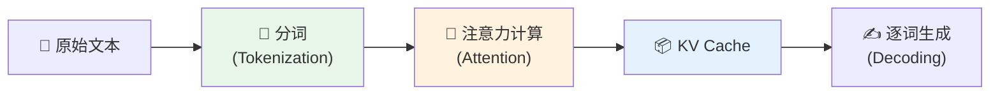
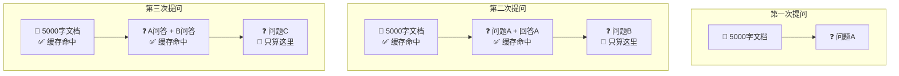
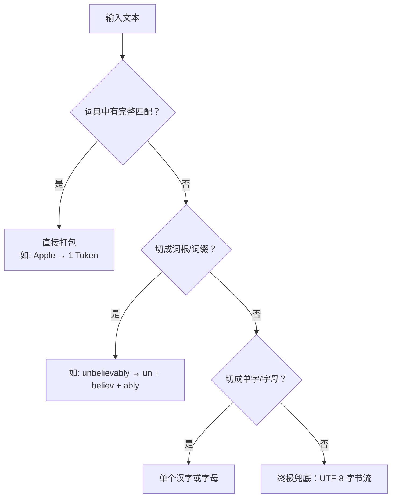
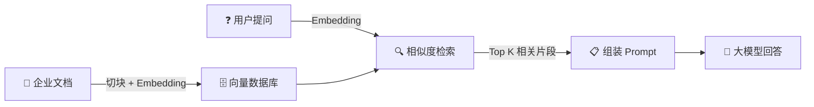
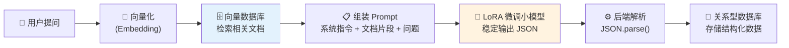

# 大模型内核解密：从 KV Cache 到 RAG+LoRA

> [!abstract] 导读
> 本文从"为什么命中缓存后 API 价格会便宜 90%"这个现实问题出发，一路拆解大模型的底层运作机制——Tokenization、注意力计算、KV Cache、单向注意力、Temperature、BPE，最终延伸到企业级架构 RAG + LoRA 的落地实战。

---

## 前置知识：几个绕不开的术语

在正式开始前，先花 2 分钟搞懂四个会反复出现的核心概念：

> [!note]- **Token（词元）**—— AI 阅读的最小单位
> 人类读文字以"词"为单位，AI 则以 **Token** 为单位。Token 不完全等于"词"：一个英文长词可能被拆成多个 Token，一个常见短语也可能被合并成一个 Token。
>
> 粗略换算：**1 个中文汉字 ≈ 1~2 个 Token**，**1 个英文单词 ≈ 1~3 个 Token**。API 按 Token 数量计费，所以它是理解大模型成本的基本度量单位。

> [!note]- **Transformer —— 大模型的"大脑架构"**
> Transformer 是 2017 年 Google 提出的一种神经网络架构，是当今所有主流大模型（GPT、Claude、Gemini、Llama）的共同底座。它的核心创新是**注意力机制（Attention）**——让模型在处理每一个词时，能"看到"并衡量它与文本中所有其他词的关联程度。
>
> 你可以把 Transformer 想象成一个**超级会议室**：每个词都是一位参会者，它在发言前会先扫一眼所有其他参会者，判断谁跟自己的话题最相关，然后重点参考那些人的信息来组织自己的发言。

> [!note]- **向量（Vector）—— AI 的"数学语言"**
> AI 不懂人类语言，它只懂数字。**向量**就是一串有序的数字（如 `[0.12, -0.85, 0.33, ...]`），通常有几百到几千个维度。
>
> 模型会把每个 Token 转换成一个向量，这些数字编码了词的**语义信息**——意思相近的词，向量在数学空间中的距离也近。比如"国王"和"女王"的向量很接近，而"国王"和"苹果"的向量相距很远。

> [!note]- **GPU（显卡）—— AI 的"发动机"**
> 大模型的计算本质是海量的矩阵乘法，而 **GPU**（图形处理器，俗称显卡）天生擅长并行处理这类运算。训练和运行大模型都依赖 GPU，它的算力和显存大小直接决定了模型能跑多快、能处理多长的文本。
>
> 文中提到的"算力成本"、"显存压力"，本质上都是在说 GPU 资源的消耗。

---

## 一、大模型处理文本的两个阶段

当你向 Claude 或 GPT 发送一段文字时，模型并不能直接读懂汉字或英文。它需要经历两个关键阶段：

### 1.1 分词（Tokenization）—— 便宜的"切菜"

模型拿到文本后，第一步是查字典，把它切分成一个个 Token。

- **成本**：极低，只是简单的字符串匹配和查表替换
- **缓存不管这一步**：哪怕命中缓存，新文本依然要瞬间切成 Token

### 1.2 注意力计算（Attention）—— 昂贵的"慢炖"

Token 被送进由几十甚至上百层 Transformer 神经网络组成的"大脑"。模型要计算每一个 Token 和其他所有 Token 之间的关联性。

- **结果**：每个 Token 生成一组高维数学向量——**Key（键）** 和 **Value（值）**
- **成本**：极高，文本越长计算量呈==平方级==增长（因为每个词都要和其他**所有词**两两配对计算关联——100 个词需要算 $100 \times 100 = 10000$ 次，1000 个词就是 $1000000$ 次，增长 100 倍！）
- **这正是缓存要保存的东西！**

> [!tip] 做菜的比喻
> **切菜**（生成 Token）：把鲍鱼、海参切块，几分钟搞定。
> **慢炖**（注意力计算）：放进高压锅，文火炖 8 小时让味道融合——这才是最费火的步骤。
> **缓存**（KV Cache）：把炖好的一大锅汤放进冰箱。下次只要把新加的几片菜叶扔进老汤里热一下就能出锅。

---

## 二、KV Cache：缓存的本质

### 2.1 什么是 KV Cache？

KV Cache 就是把注意力计算阶段产出的 **Key 和 Value 矩阵直接存起来**，避免重复计算。

| 环节 | 无缓存（重新计算） | 命中缓存（读取数据） |
|------|---------------------|----------------------|
| **计算开销** | 极高，GPU 满负荷运行 | 极低，几乎不需重算 |
| **I/O 开销** | 低 | 中（需从显存读取） |
| **厂商定价** | 全额收费 | ==大幅折扣（通常 1~2 折）== |

以 Claude Sonnet 为例：
- **写入缓存**（Cache Write）：比普通输入贵约 25%
- **命中缓存**（Cache Read）：比普通输入==便宜 90%==

> [!important] 为什么便宜？
> 对厂商来说，读取已算好的结果比让 GPU 重新"烧脑"要省电、省时间得多。省下的成本回馈给开发者，鼓励使用长上下文。

### 2.2 前缀匹配：累加内容如何命中缓存？

缓存遵循一个严格原则：==只要开头（前缀）完全一样，之前的计算结果就是通用的。==

想象你在写一本书，现在写到了第 100 页：

- **第 1-99 页**：固定不动的"前缀"
- **第 100 页**：正在写的新内容

API 厂商通常以 **1024 个 Token** 为一个 Block。只要前 1024 个词没变，第一个 Block 命中；前 2048 个词没变，第二个也命中……直到新提问的地方缓存才失效。

> [!warning] 修改中间内容 = 缓存失效
> 如果你改了中间的一个词，由于 Transformer 的注意力机制是**自回归**的（即每个词的计算结果依赖它前面所有词的结果，像多米诺骨牌一样逐个传递），后面所有计算结果全部作废，必须重算。这就是为什么在长对话中"编辑"某条消息后，响应会变慢且变贵。

---

## 三、QKV 机制：新内容如何"引用"旧内容

你可能会问：计算新问题 B 时，难道不需要引用前面的 5000 字吗？

**答案是必须引用**——但"引用"不等于"重算"。

### 3.1 Query-Key-Value 查表逻辑

每个 Token 经过计算后会生成三个核心向量：

| 向量 | 含义 | 类比 |
|------|------|------|
| **Key（K）** | 这个词"长什么样"，包含哪些特征 | 字典的索引 |
| **Value（V）** | 这个词"实际含金量是多少" | 字典的释义 |
| **Query（Q）** | 当前词想要寻找什么信息 | 你的查询请求 |

当模型处理新增的第 6000 个词时：

1. 只为第 6000 个词生成新的 **Query** 向量
2. 拿着 Query 去跟已缓存的老内容 **Key** 匹配（计算注意力权重）
3. 根据权重去取老内容的 **Value**

$$
\text{Attention}(Q_{6000}, K_{1:5999}, V_{1:5999}) = \text{softmax}\left(\frac{Q_{6000} \cdot K^T}{\sqrt{d_k}}\right) V
$$

> [!example] 开卷考试 vs 闭卷背诵
> - **没有缓存**：每次问新问题，AI 要把 5000 字从头到尾**重新背诵**、重新做笔记，然后才回答——字数越多，背的时间越长
> - **有缓存**：AI 已经做好了**详细的索引笔记（KV Cache）**摆在桌上，只需扫一眼新问题，然后翻笔记查阅

### 3.2 为什么还有 10% 的基础计费？

- **读取成本**：从缓存层把 KV 矩阵搬运回显存需要带宽和时间
- **注意力计算**：新问题 B 与 5000 字之间的注意力比对仍占用少量算力

---

## 四、单向注意力：为什么不能"往后看"？

### 4.1 双向计算的好处

在语言中，一个词的真正含义往往取决于**它后面的词**。

> [!example] "苹果"到底是什么？
> 假设 5000 字文档中，第 10 个词是**"苹果"**。在单向注意力下，模型处理到第 10 个词时，根本不知道后面会出现什么，只能保留一个模糊的概念——它既可能是🍎水果，也可能是科技公司。
>
> 但如果允许**双向计算**，当第 6000 个词（你的新问题）是"它的最新财报和市值是多少？"时，第 10 个词就能和第 6000 个词做注意力计算。由于第 6000 个词表达的是"商业公司"语境，第 10 个词的内部特征会被立刻修正——=="哦！这里的苹果指的是苹果公司！"== 它的数学向量会变得极其精准。

这种前后互看的机制叫**双向注意力**（Bidirectional Attention），Google 的 **BERT** 模型就是这么做的，所以 BERT 在阅读理解、情感分析这类"归纳总结"任务上表现堪称完美。

### 4.2 既然更好，为什么 GPT/Claude 不用？

GPT、Claude 这类生成式模型用的是**单向注意力**（Causal Attention）：只能往回看，不能往后看。它们忍痛放弃了双向计算带来的更好理解力，是因为两个致命的物理瓶颈：

> [!danger] 致命伤一：缓存机制会崩溃
> 如果允许第 10 个词根据第 6000 个词重新计算，那之前存好的 5000 个词的 KV Cache ==全部作废==。每次新提问，GPU 都得重算几千上万个词。**成本高到连 OpenAI 都破产。**

> [!danger] 致命伤二：生成是"预测未来"
> 模型在写第 6001 个词时，第 6002 个词**根本还不存在**。既然不存在就无法往后看。为保持一致性，科学家们一刀切：所有词都只能往回看。

### 4.3 那回答质量怎么保证？

模型采用了**"最后买单"** 的兜底策略：

1. **前面的词"保持中立"**：第 10 个词（如"苹果"）同时保留"水果"和"公司"两种特征
2. **最后的词"统揽全局"**：新问题（如"市值多少？"）能往回看所有 5000 个词
3. **精准提取**：新问题的 Query 在扫过第 10 个词时，自动激活"公司"特征，忽略"水果"

---

## 五、缓存的弊端

天下没有免费的午餐。KV Cache 存在以下显著弊端：

> [!warning] ① 成本的"反向背刺"
> - **写入加价**：Cache Write 通常比普通输入贵 25%，只用一次反而更亏
> - **最小长度限制**：通常要求达到 1024~2048 Tokens 才能开启
> - **存储计费**：如 Gemini 某些模式按存储时长收费

> [!warning] ② 严格的"前缀强迫症"
> - 中间改一个字 → 后续缓存全部失效
> - 文档顺序调换 → 即使内容相同也无法命中

> [!warning] ③ 内存与显存压力
> - KV Cache 体积随上下文线性增长
> - 高并发下缓存可能被提前"驱逐"

> [!warning] ④ "逻辑锁定"风险
> - 上下文过长（10万字+）→ 注意力可能失焦
> - 更新数据但忘记刷新缓存 → AI 基于旧数据胡说

### 避坑指南

| 弊端 | 后端对策 |
|------|---------|
| 写入加价 | 仅对预期互动 **≥3 次**的内容开启缓存 |
| 前缀敏感 | **静态内容**放前面，**动态内容**放最后 |
| 生存时间短 | 高频应用设置"心跳"请求维持缓存热度 |

### 缓存最适合的四类场景

虽然有弊端，但在以下场景中缓存是绝对的"省钱神器"：

| 场景 | 说明 | 为什么适合 |
|------|------|-----------|
| **长文档/书籍对话** | 反复询问同一本书的内容 | 文档不变，天然满足前缀一致 |
| **少样本学习（Few-shot）** | 在 Prompt 中塞入几十个固定示例 | 示例不变，只有末尾的新问题变化 |
| **代码助手** | 整个项目上下文固定，不断提新需求 | 项目代码是稳定的大前缀 |
| **角色设定** | 给 AI 设定几万字的复杂背景故事 | 设定是固定前缀，每次对话只加新问题 |

> [!note] 什么是"上下文窗口"（Context Window）？
> 每个大模型都有一个**上下文窗口上限**——即单次对话能处理的最大 Token 数量。例如 Claude 3.5 Sonnet 的上下文窗口是 200K Token（约 15 万字中文）。
>
> 这个上限的本质原因就是 **KV Cache 的显存占用**：文本越长，需要存储的 Key 和 Value 矩阵越大。当显存被塞满时，模型就无法再处理更多文本了。这也是为什么厂商在拼命扩大上下文窗口——它直接决定了 AI 能"记住"多少东西。

---

## 六、Temperature：为什么每次回答都不一样？

大模型本质上是一个**概率预测机**。它不会直接吐出一个词，而是给词汇表里的几万个词分别打分。

假设输入"床前明月"，模型得分：`光: 90分 | 夜: 5分 | 饼: 1分`

接下来模型要把这些"原始分数"转换成加起来等于 100% 的概率——这个转换函数叫 **Softmax**（可以理解为"把分数变成概率的计算器"）。而 **Temperature（$T$）** 就是插在 Softmax 里的一个旋钮，用来调节概率分布的"尖锐程度"：

$$
p_i = \frac{\exp(z_i / T)}{\sum_j \exp(z_j / T)}
$$

| 温度设置 | 效果 | 适用场景 |
|----------|------|---------|
| $T \to 0$ | 极度放大最高分优势（99.99% 选"光"） | 代码生成、数据提取、法律分析 |
| $T = 1$ | 正常概率分布 | 通用对话 |
| $T > 1$ | 拉平概率差异，更多"创意" | 头脑风暴、写诗、营销文案 |

> [!quote] 一句话总结
> AI 每次回答不一样，是因为它在最终选词时是在**摇骰子**，而 Temperature 是控制骰子重心的**配重铅块**。

---

## 七、BPE：AI 如何理解生僻字和乱码

大模型使用 **BPE（Byte Pair Encoding，字节对编码）** 切词算法，采用"碎纸机"策略：

即使被切碎成无意义的字母组合，经过 Transformer 数百层的注意力计算后，模型依然能从**上下文**推断其作用。

> [!example] 乱码也能懂
> 输入："这件衣服的质量真是 *asdfghjkl* 差到爆了！"
> 即使 `asdfghjkl` 被切成多个无意义的字母 Token，模型通过和"质量"、"差到爆"的注意力关联，依然理解它是一个**表示极端情绪的语气词**。

---

## 八、从缓存到架构：微调与 RAG

### 8.1 微调（Fine-tuning）的本质

> [!important] 核心认知
> 微调改变的是 AI 的**行为模式（Style）**，而不是它的**记忆库（Knowledge）**。

- **预训练** = 完成九年义务教育的通才
- **微调** = 送去"蓝翔技校"学挖掘机

**微调的杀手级应用：**
- 强制输出 JSON/SQL，绝不带废话
- 统一语气与人设
- 学习私有"黑话"或特殊计算逻辑

**微调==不适合==做的事：**
- ❌ 背诵新知识（会导致**灾难性遗忘**）
- ❌ 精准回答事实问题（会产生**幻觉**）
- ❌ 动态更新内容（改版需重新训练）

> [!info] 什么是"灾难性遗忘"？
> 神经网络的参数是一个整体——就像大脑的神经回路是相互连接的。当你强行用一小批新数据去修改模型参数时，为了"记住"新知识，模型可能会把原本学过的通用能力给"挤掉"。
>
> 比如你用 1000 条土地法规数据微调模型后，它可能突然不会写 Python 代码了，或者连基本的数学题都算不对——因为存储代码能力和数学能力的那些参数，被新数据"覆盖"了。

> [!info] 什么是"幻觉"（Hallucination）？
> 微调是把知识"揉碎"融进模型的概率矩阵里。当用户问"第三条规则是什么？"时，AI 是在通过概率**"猜"**答案，而不是在**"查"**答案。它极有可能把第二条和第三条的内容混在一起，编造出一个看似合理但实际不存在的答案。
>
> 这就是为什么事实类知识应该交给 RAG（开卷考试），而不是微调（让 AI 硬背）。

### 8.2 RAG（检索增强生成）

RAG（Retrieval-Augmented Generation）= 给 AI 外挂一个数据库，让它"开卷考试"。

与微调不同，RAG **不修改模型本身**，而是在每次提问时，先从外部知识库中检索出最相关的文档片段，塞进 **Prompt（提示词）** 里让模型参考着回答。所谓 Prompt，就是你发送给大模型的**完整输入文本**——包括系统指令、背景资料、示例和你的具体问题，它是你与 AI 沟通的唯一接口。

#### Embedding：把文字变成"坐标"

RAG 的第一步是把文档转换成模型能快速检索的格式。这里用到的技术叫 **Embedding（向量嵌入）**：

- 把一段文字（比如一个段落）通过专门的嵌入模型，转换成一个**高维数字向量**（如 `[0.12, -0.85, 0.33, ...]`）
- 语义相近的文本，向量在数学空间中的**距离也近**
- 用户的提问也会被转换成向量，然后在数据库中找到"距离最近"的文档片段

> [!tip] 类比：图书馆找书
> 传统搜索像在图书馆用"书名/关键词"精确匹配——搜"苹果公司财报"，只能找到标题里包含这几个字的书。
>
> 向量检索像告诉图书管理员"我想了解一家科技巨头的财务状况"——即使书名里没有"苹果"二字，只要内容语义相关，也能被找到。

#### 向量数据库：AI 的外挂记忆

**向量数据库**（如 Milvus、Pinecone、pgvector）专门用来存储和高速检索这些向量。你可以把它理解为一个"语义搜索引擎"：

#### RAG vs 微调：什么时候用哪个？

| 对比维度 | RAG | 微调 |
|----------|-----|------|
| **核心作用** | 提供"事实"（外部知识） | 规范"行为"（输出格式） |
| **知识更新** | 随时更新，改文档即可 | 需重新训练 |
| **幻觉风险** | 低（有原文可参考） | 较高（知识融在概率里） |
| **适合场景** | 文档问答、政策查询 | 格式固定、风格统一 |
| **成本** | 需要向量数据库基础设施 | 需要 GPU 训练资源 |

### 8.3 LoRA：低成本微调的黑科技

**LoRA（Low-Rank Adaptation）** 不修改原始模型，只在旁边外挂一个极小的"补丁矩阵"：

$$
Y = W_{\text{orig}} \cdot X + \Delta W \cdot X
$$

| 优势 | 说明 |
|------|------|
| **便宜** | 原本需要 8 张 A100，现在 1 张 RTX 4090 几小时搞定 |
| **热插拔** | 白天插"客服 LoRA"，晚上换"代码 LoRA"，底层模型不动 |

### 8.4 知识蒸馏（Knowledge Distillation）

知识蒸馏就是**"拿昂贵的大模型当老师，给便宜的小模型当陪练"**。

具体流程：

1. **造数据**：把 1000 份业务文档发给顶级大模型（如 GPT-4o），让它生成 1000 个高质量的标准问答结果
2. **训练小模型**：用这 1000 条"老师的标准答案"，通过 LoRA 微调一个开源小模型（如 Qwen-7B）
3. **上线替换**：小模型学会了大模型的"输出习惯"后，在生产环境中==彻底替代大模型==

> [!tip] 替代后的收益
> - **成本断崖式下跌**：调用 GPT-4o 处理一份长文档要几毛钱；自己的服务器跑小模型几乎只有电费
> - **延迟极低**：小模型生成 JSON 是毫秒级，大模型可能要等好几秒
> - **数据安全**：业务数据不再通过 API 发往国外，全部在私有服务器上内循环
> - **无并发限制**：不受 API 厂商的限流（Rate Limit），多起几个容器就能水平扩展

> [!quote] 一句话总结
> 用大模型花了一次性的钱，买到"智慧结晶（数据）"；然后用 LoRA 把结晶注入"免费的小模型"脑子里。

---

## 九、终极架构：RAG + LoRA 的"黄金流水线"

**分工明确：**

| 技术方案 | 角色 | 核心原理 | 适用场景 |
|----------|------|---------|---------|
| **RAG** | 图书管理员，提供"事实" | 向量检索 + 缓存 + 丢给 Prompt | 查询文档、实时政策、员工手册 |
| **LoRA 微调** | 专业打字员，规范"行为" | 修改模型权重（加补丁） | 固定 JSON 输出、行业黑话、代码补全 |

### 落地两步走

> [!success] 阶段一：先跑通 RAG
> 1. 选向量数据库（轻量可用 pgvector）
> 2. 核心文档切块（Chunking）存入向量库——所谓"切块"，就是把一份长文档按段落、章节或固定字数拆分成几百字的小片段，每个片段独立做 Embedding 后存入向量数据库。这样检索时才能精准定位到**最相关的那一小段**，而不是把整篇文档丢给模型
> 3. 用原生大模型 + 强提示词测试

> [!success] 阶段二：再上 LoRA 微调
> 1. 收集阶段一中大模型回答最完美的 500~1000 条数据
> 2. 用这批数据对开源小模型（Llama-3-8B / Qwen-7B）做 LoRA 微调
> 3. 微调后删掉 80% 系统提示词，格式稳定性从 90% → 99.9%

---

## 十、核心概念速查表

| 核心技术 | 干什么的 | 后端类比 | 核心收益 |
|----------|---------|---------|---------|
| **KV Cache** | 持久化前缀文本的注意力矩阵 | 带状态的 Redis | 省钱提速，前缀须一致 |
| **单向注意力** | 模型只能往回看 | 流式数据处理 Stream | 缓存和文字接龙的物理基础 |
| **Temperature** | 控制生成词的概率分布 | 随机数种子/权重 | 设 0 保稳定，设高出创意 |
| **BPE** | 把生僻字切碎成认识的片段 | 强容错解析器 | 乱码也不崩，结合上下文推断 |
| **知识蒸馏** | 用大模型跑数据生成问答对 | 花钱买高质量 Mock Data | 低成本获取训练数据 |
| **LoRA** | 给小模型打极小的权重补丁 | 修改框架的拦截器/中间件 | 让小模型稳定输出 JSON |
| **RAG** | 外挂向量数据库做检索 | 给函数传入外部参数 | 事实准确，随时可更新 |

---

> [!info] 来源
> 本文整理自与 Gemini 的深度对话，原始记录见 [[gemini-communication/大模型缓存：原理与价格]]
