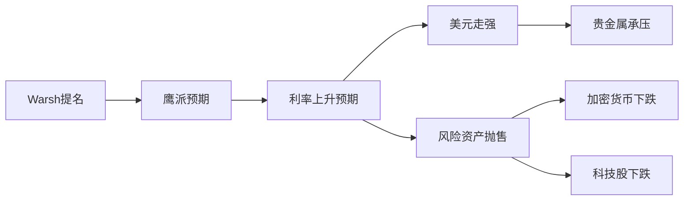

> [!info] 研究概览
> **研究日期**: 2026-02-05
> **事件日期**: 2026-02-04
> **研究范围**: 加密货币市场、美股市场、贵金属市场
> **核心发现**: 多个市场同步下跌，主要由美联储政策预期变化驱动

---

## 📊 市场表现总览

### 加密货币市场 🪙

| 资产类别 | 价格/流出 | 跌幅 | 备注 |
|---------|----------|------|------|
| **Bitcoin (BTC)** | $78,867 | -9.9% (7天) | 远低于1月高点 $97,511 |
| **Ethereum (ETH)** | $2,370 | -18%+ (周) | 较历史高点下跌约52% |
| **BTC ETF 流出** | $1.32B | - | 单周流出 |
| **ETH ETF 流出** | $308M | - | 单周流出 |
| **总资产流出** | $1.7B | - | 数字资产投资产品 |

> [!warning] 关键数据
> - 年初至今流出转为负值：约 **-$1B** 全球流出
> - 自2025年10月价格高点以来，管理资产总额下降 **$73B**

### 美股市场 📈

| 指数 | 收盘价 | 涨跌 | 涨跌幅 |
|------|--------|------|--------|
| **S&P 500** | 4,512.34 | -36.45 | -0.8% |
| **Nasdaq** | 14,203.45 | -172.30 | -1.2% |
| **Dow Jones** | 37,891.67 | +38.12 | +0.1% |
| **Russell 2000** | 1,987.65 | -12.40 | -0.6% |

**行业表现**:
- 🔻 **科技股领跌**: Nasdaq-100 下跌 1.4%
  - Nvidia: -2.5% → $112.34
  - Tesla: -3.2% → $210.50
  - Apple & Microsoft: 均跌超 1%
- 🔺 **能源股支撑**: Exxon Mobil +1.8%

### 贵金属市场 🥇

| 金属 | 最低价 | 跌幅 | 反弹价 | 年初至今 |
|------|--------|------|--------|----------|
| **黄金** | $4,404/oz | -21.2% | $4,800 | +9.1% |
| **白银** | $71.67/oz | -41.1% | $84 | +9.4% |

> [!danger] 史无前例的波动
> 日本贵金属市场协会 Bruce Ikemizu：
> *"观察这个市场40年，这种波动水平是史无前例的。"*

**相关市场**:
- 铜期货: 较周四高点下跌 15%
- 锡: -8%
- 镍: -5%

---

## 🔍 下跌原因深度分析

### 1️⃣ 核心驱动因素：美联储政策预期转变

#### Kevin Warsh 提名效应

> [!important] 政策转向信号
> **特朗普提名 Kevin Warsh 为下任美联储主席**
> - **立场**: 鹰派，主张渐进加息控制通胀
> - **市场解读**: 利率可能维持高位更长时间
> - **影响**: 打压风险资产估值

**传导机制**:


#### 美元指数反弹
- 从 **4年低点** 反弹 **0.3%**
- 强美元对以美元计价的资产形成压力
- 特别影响黄金、白银等传统避险资产

### 2️⃣ 加密货币特定因素

#### 资金流出分析

**地理分布**:
- 🇺🇸 美国: $1.65B 流出（占比 97%）
- 🇨🇦 加拿大: $37.3M 流出
- 🇸🇪 瑞典: $18.9M 流出
- 🇨🇭 瑞士: $11.0M 流入 ✅
- 🇩🇪 德国: $4.3M 流入 ✅

**资产分布**:
- Bitcoin: $1.32B 流出
- Ethereum: $308M 流出
- XRP: $43.7M 流出
- Solana: $31.7M 流出
- **Short-Bitcoin**: $14.5M 流入（看空情绪）

#### CoinShares 分析师观点

**James Butterfill 指出三大原因**:
1. **鹰派美联储主席任命** - 政策不确定性
2. **四年周期巨鲸抛售** - 市场周期性规律
3. **地缘政治波动加剧** - 全球风险上升

### 3️⃣ 贵金属特定因素

#### 保证金要求提高
- 美国和中国交易所 **同步提高保证金要求**
- 触发 **强制平仓** 和 **杠杆去化**
- 加剧价格下跌速度

#### 交易量异常
- iShares 白银 ETF 周五交易量超 **$40B**
- 成为 **"历史上交易最活跃的证券之一"**
- 超过 Apple 和 Amazon 的合计交易量

### 4️⃣ 美股特定因素

#### 就业数据不及预期
- **非农就业**: 增加 225,000（预期 250,000）
- **失业率**: 维持 4.1%
- **工资增长**: 月增 0.3%，年化 4.1%（高于美联储 2% 目标）

**市场解读**:
- ✅ 劳动力市场降温 → 可能支持降息
- ❌ 工资增长仍高 → 通胀压力持续

#### 科技股供应链问题
- **Nvidia**: 因美中贸易问题导致供应链中断
- **Tesla**: 欧洲电动车需求放缓
- **AI 炒作降温**: 投资者重新评估估值

---

## 🔗 市场关联性分析

### 共同驱动因素矩阵

| 因素 | 加密货币 | 美股 | 贵金属 | 影响程度 |
|------|---------|------|--------|----------|
| **Warsh 提名** | ✅✅✅ | ✅✅ | ✅✅✅ | 🔴 极高 |
| **美元走强** | ✅✅ | ✅ | ✅✅✅ | 🔴 高 |
| **利率预期** | ✅✅✅ | ✅✅ | ✅✅ | 🔴 极高 |
| **风险偏好下降** | ✅✅✅ | ✅✅ | ✅ | 🟡 中高 |
| **地缘政治** | ✅✅ | ✅ | ✅✅ | 🟡 中 |
| **保证金提高** | ✅ | - | ✅✅✅ | 🟡 中（特定市场）|

### 相关性分析

#### 风险资产同步下跌
```
加密货币 ⇄ 科技股
- 都属于高风险、高增长资产
- 对利率变化高度敏感
- 投资者群体重叠度高
```

#### 避险资产失效
```
传统避险逻辑: 市场下跌 → 买入黄金
本次异常: 市场下跌 → 黄金也暴跌
原因:
  1. 强美元压制
  2. 杠杆去化
  3. 流动性需求（抛售黄金获取现金）
```

#### 美元成为唯一避风港
- 10年期美债收益率: 4.08% → 4.15%
- 资金流向: 风险资产 → 美元 + 美债

---

## 💡 专家观点与市场展望

### 看空观点 🐻

**Beth Ann Bovino** (U.S. Bank Wealth Management 首席经济学家):
> "虽然劳动力市场保持韧性，但低于预期的招聘表明经济活动有所降温。这可能给美联储今年晚些时候降息提供更多空间，但持续的通胀仍是未知数。"

**Michael Brown** (Pepperstone 市场策略师):
> "美联储主席鲍威尔强调数据依赖的方法，今天的就业数据倾向于3月可能降息。但地缘政治风险可能推高能源成本，使前景复杂化。"

### 看多观点 🐂

**J.P.Morgan** (贵金属展望):
- 维持看涨立场
- 预测黄金将在 2026 年达到 **$6,300/oz**
- 理由: "结构性、持续的多元化趋势" 和 "实物资产相对纸质资产的优异表现"

### 中性观点 ⚖️

**市场共识**:
- 预期 2026 年 **3次降息**
- 但任何高于预期的通胀数据都可能破坏这一预期
- 波动性将持续存在

---

## 📌 关键要点总结

> [!summary] 核心结论
> 1. **政策驱动**: Kevin Warsh 提名是最主要的催化剂
> 2. **多市场共振**: 加密货币、美股、贵金属同步下跌
> 3. **美元主导**: 强美元成为压制所有资产的核心力量
> 4. **杠杆去化**: 保证金提高加速贵金属和加密货币下跌
> 5. **避险失效**: 传统避险资产（黄金）未能发挥作用

### 投资启示 💼

1. **分散化重要性**: 单一资产类别无法提供有效保护
2. **政策敏感性**: 美联储政策预期是最重要的市场驱动力
3. **杠杆风险**: 高杠杆在波动期会放大损失
4. **美元地位**: 在全球不确定性中，美元仍是最终避风港

---

## 📚 信息来源

### 加密货币市场
- [Bitcoin and Ethereum ETF Investments Flip Negative](https://decrypt.co/356622/bitcoin-ethereum-etf-investments-flip-negative-for-2026-as-crypto-funds-shed-1-7b)
- [Bitcoin, Ethereum ETFs Shed Nearly All 2026 Gains](https://decrypt.co/354246/bitcoin-ethereum-etfs-shed-nearly-all-2026-gains-rate-cut-hopes-fade)

### 贵金属市场
- [Unprecedented Crash: Gold Sink 21%, Silver Drops 40%](https://www.bullionvault.com/gold-news/gold-price-news/gold-silver-record-020220261)
- [The February Massacre: Gold and Silver Plummet](http://business.thepilotnews.com/thepilotnews/article/marketminute-2026-2-2-the-february-massacre-gold-and-silver-plummet-as-warsh-surprise-and-margin-hikes-end-the-precious-metals-super-cycle)

### 美股市场
- [Stocks finish mostly lower as software shares drag](https://www.marketwatch.com/livecoverage/stock-market-today-dow-sp500-nasdaq-up-after-software-dive-amd-down-alphabet-gold/)
- [Dow Rises, S&P 500 and Nasdaq Fall](https://www.barrons.com/livecoverage/stock-market-news-today-020426)

### 美联储政策
- [Trump picks Kevin Warsh to lead Federal Reserve](https://www.politico.com/news/2026/01/30/trump-taps-kevin-warsh-to-lead-federal-reserve-00752043)
- [What a Warsh Fed Would Mean for Interest Rates](https://www.barrons.com/articles/trump-fed-kevin-warsh-interest-rates-inflation-37393e58)

---

## 🏷️ 标签

#加密货币 #比特币 #以太坊 #美股 #贵金属 #黄金 #白银 #美联储 #利率政策 #市场分析 #2026

---

*报告生成时间: 2026-02-05*
*研究方法: 多源信息综合分析*
*数据来源: 公开市场数据和新闻报道*
