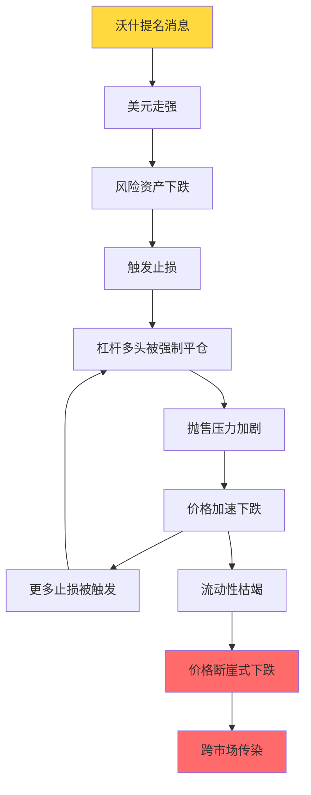
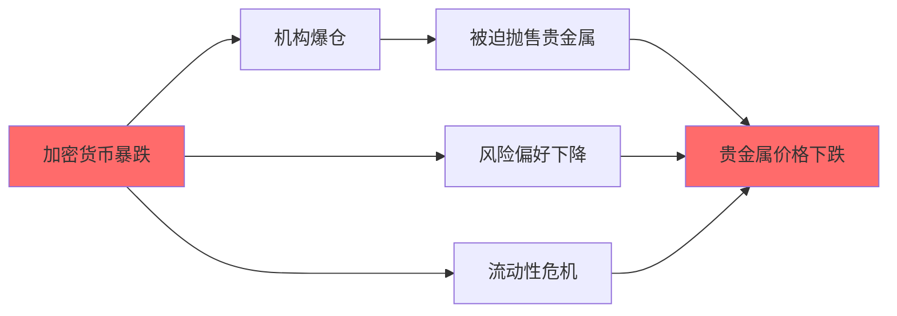
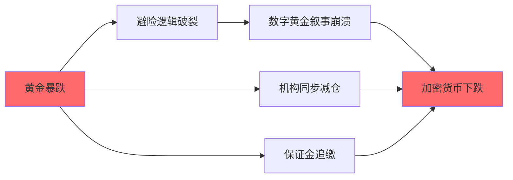
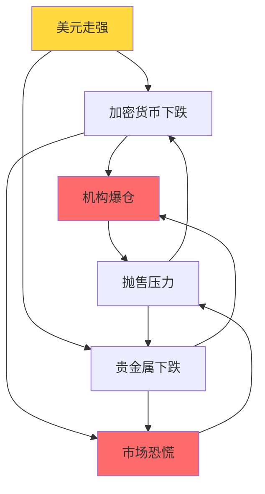
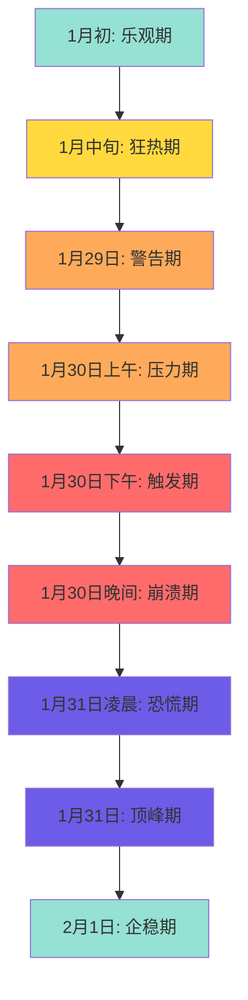

# 2026年1月30日加密货币与贵金属市场暴跌深度研究报告

> [!info] 报告基本信息
> - **研究日期**: 2026年2月2日
> - **研究范围**: 比特币(BTC)、以太坊(ETH)、币安币(BNB)、黄金、白银
> - **事件时间**: 2026年1月29-31日
> - **研究方法**: 多源信息交叉验证、市场数据分析、政策影响评估

---

## 📊 核心要点速览

> [!warning] 市场暴跌概况
> 2026年1月30日，全球金融市场经历了一场历史性的暴跌事件。加密货币和贵金属市场同时遭遇重创，这是近年来罕见的跨市场崩盘事件。

- **比特币 (BTC)**: 从约10.9万美元暴跌至最低75,500美元，跌幅超30%
- **以太坊 (ETH)**: 从约3,000美元跌至最低2,202美元，跌幅超26%
- **币安币 (BNB)**: 跌幅超9%，从约900美元跌至779美元
- **黄金**: COMEX期货暴跌超12%，创近40年最大单日跌幅
- **白银**: 暴跌超30%（最大跌幅达35.3%），创1980年以来最大单日跌幅

**核心结论**: 此次暴跌是由**特朗普提名凯文·沃什为美联储主席**引发的美元走强、**高杠杆多头强制平仓**导致的流动性危机、以及**通胀数据超预期**共同作用的结果。这是一次典型的"多杀多"事件，杠杆清算引发的死亡螺旋导致跨资产类别的连锁崩盘。

---

## 💥 一、市场暴跌详细数据

> [!note] 数据说明
> 以下数据来自多个交易所和数据源，部分数据因交易所差异略有不同。所有价格均为美元计价。

### 1.1 加密货币市场

#### 📉 主要加密货币跌幅对比

| 币种 | 暴跌前价格 | 最低点 | 收盘价 | 最大跌幅 | 24h跌幅 |
|------|-----------|--------|--------|---------|---------|
| **比特币 (BTC)** | 10.9万美元 | 7.55万美元 | 7.87-8.19万美元 | ==-30.7%== | -6~8% |
| **以太坊 (ETH)** | 3,000美元 | 2,202美元 | 2,395-2,726美元 | ==-26.6%== | -9~13% |
| **币安币 (BNB)** | 900美元 | 779美元 | - | ==-9%+== | - |

> [!danger] 市场整体损失
> **爆仓规模创历史记录**
> - 💔 **爆仓人数**: 超过 ==42万人==
> - 💸 **爆仓金额**: ==25.59亿美元==（约180亿人民币）
> - 📊 **比特币多头爆仓**: 超过7.77亿美元
> - 📉 **市场整体跌幅**: 7-9%
>
> 这是加密货币市场历史上规模最大的爆仓事件之一。

### 1.2 贵金属市场

#### 🥇 黄金与白银跌幅对比

| 品种 | 跌幅 | 历史意义 | 市场反应 |
|------|------|---------|---------|
| **黄金** | COMEX期货 -12%+ | ==40年来最大单日跌幅== | 现货黄金跌9.25%，沪金振幅9.13% |
| **白银** | COMEX期货 -31.4% | ==1980年以来最惨烈暴跌== | 最大跌幅达35.3%，46年纪录 |

> [!warning] 贵金属市场特征
> **从极端超买到恐慌崩盘**
> - 📈 **暴跌前状态**: 黄金1月份爆炸性上涨，技术指标严重超买
> - 📉 **暴跌过程**: 白银单日跌幅26.42-30%，创历史纪录
> - 🏦 **交易所反应**: 芝商所(CME)紧急上调贵金属保证金要求
> - 📊 **相关市场**: 黄金概念股集体跌停
> - 😱 **市场情绪**: 从极端狂热瞬间转向恐慌崩盘

#### 📊 历史对比

这次贵金属暴跌在历史上具有重要意义：
- **白银**: 创1980年以来（46年）最大单日跌幅
- **黄金**: 创近40年最大单日跌幅
- **同步性**: 罕见的加密货币与贵金属同步崩盘

---

## 🔍 二、暴跌根本原因深度解析

> [!question] 为什么会发生这场暴跌？
> 这次暴跌不是单一原因造成的，而是**三大因素共同作用**的结果。让我们逐一深入分析。

### 2.1 💼 原因一：美联储主席人选引发政策预期转变

#### 关键事件

**2026年1月30日**，特朗普宣布提名凯文·沃什(Kevin Warsh)接替鲍威尔担任美联储主席。

> [!tip] 为什么这个提名如此重要？
> 美联储主席是全球最有权力的经济政策制定者之一，他的政策立场直接影响：
> - 💵 美元汇率走势
> - 📊 全球资本流动
> - 💰 风险资产价格
> - 🏦 市场流动性预期

#### 沃什的政策立场

| 政策方向 | 具体立场 | 市场影响 |
|---------|---------|---------|
| **利率政策** | 鹰派倾向，主张维持相对高利率对抗通胀 | 降息预期降温 |
| **美联储独立性** | 保守派人士，支持美联储独立性 | 缓解政治化担忧 |
| **政策组合** | 主张"降息+缩表"并行，而非激进宽松 | 流动性预期修正 |
| **市场预期** | 稳健派，不会激进放水 | 风险资产承压 |

#### 市场如何解读这个提名？

1. **美元走强** 💪
   沃什提名被视为美联储将保持稳健政策的信号，美元指数大幅反弹

2. **流动性预期修正** 💧
   市场修正了对美元流动性大幅宽松的过度预期

3. **利率路径调整** 📈
   虽然2026年降息空间可能达100个基点(BP)，但节奏将更加谨慎

4. **避险资产重估** ⚖️
   黄金、白银等避险资产的估值逻辑被打破

### 2.2 📈 原因二：通胀数据超预期

#### PPI数据公布（2026年1月30日上午）

> [!info] 什么是PPI？
> PPI(生产者价格指数)衡量的是生产者出厂价格的变化，是**上游通胀**的重要指标。PPI上涨通常会传导到消费端，推高CPI(消费者价格指数)。

**12月PPI数据一览**：

| 指标 | 实际值 | 预期值 | 结果 |
|------|--------|--------|------|
| **PPI环比** | 0.5% | - | ==超预期== |
| **PPI年率** | 3.0% | 2.7% | ==超预期== |
| **核心PPI环比** | 0.7% | - | ==超预期== |
| **核心PPI年率** | 3.3% | - | ==加速上涨== |

#### 通胀数据为何如此重要？

> [!warning] 四大影响
> 1. **上游通胀顽固** 🏭
>    生产者价格持续上涨，成本压力向消费端传导
>
> 2. **关税效应** 🚢
>    特朗普关税政策推高进口成本，加剧通胀压力
>
> 3. **美联储政策** 🏦
>    强化美联储维持高利率的必要性，不能轻易降息
>
> 4. **降息预期降温** ❄️
>    市场对2026年降息次数和幅度的预期大幅下调

### 2.3 ⚠️ 原因三：高杠杆多头强制平仓

> [!danger] 杠杆是双刃剑
> 杠杆能放大收益，但在极端行情中也会放大损失。当价格下跌触发强制平仓时，会形成"多杀多"的死亡螺旋。

#### 暴跌前的杠杆拥挤程度

**加密货币市场** 🪙：
- 📈 1月份BTC从约7.5万美元暴涨至10.9万美元（涨幅==45%==）
- 🎰 大量杠杆多头在高位建仓，期待继续上涨
- 📊 期货持仓量创历史新高，市场杠杆率极高

**贵金属市场** 🥇：
- 🚀 黄金1月份爆炸性上涨，技术指标严重超买
- 💰 白银投机性持仓达到极端水平
- 🇨🇳 中国投机客大量参与，杠杆倍数普遍较高

#### "多杀多"死亡螺旋全过程

> [!abstract] 五个阶段详解
> **第一阶段：触发** 🎯
> 沃什提名消息 → 美元走强 → 风险资产开始下跌
>
> **第二阶段：止损** ⛔
> 价格下跌触发止损 → 杠杆多头被强制平仓
>
> **第三阶段：加速** ⚡
> 强制平仓加剧下跌 → 更多止损被触发 → 恶性循环开始
>
> **第四阶段：崩溃** 💥
> 流动性枯竭 → 买盘消失 → 价格断崖式下跌
>
> **第五阶段：传染** 🦠
> 跨市场传染 → 加密货币与贵金属同步崩盘

#### 流动性危机的四大表现

| 表现 | 具体情况 | 影响 |
|------|---------|------|
| **保证金上调** | 芝商所紧急提高贵金属保证金要求 | 加剧抛售压力 |
| **算法交易放大** | 高频交易和算法反馈循环 | 波动性急剧放大 |
| **跨市场传染** | 加密货币爆仓16.8亿美元传导至贵金属 | 危机蔓延 |
| **流动性枯竭** | 买盘消失，卖盘堆积 | 价格失控下跌 |

### 2.4 😱 市场情绪：从极端贪婪到极端恐慌

> [!tip] 情绪指标的重要性
> 市场情绪往往是重要的反向指标。当市场极度贪婪时，往往是顶部信号；当市场极度恐慌时，可能是底部机会。

#### 情绪转变时间线

| 时间 | 市场情绪 | 具体表现 |
|------|---------|---------|
| **1月初** 🟢 | 极度乐观 | 特朗普就职，市场乐观情绪高涨 |
| **1月中旬** 🟡 | 极度贪婪 | BTC突破10万美元，黄金创历史新高 |
| **1月29日** 🟠 | 开始动摇 | 沃什提名消息传出，市场开始不安 |
| **1月30日** 🔴 | 极度恐慌 | 恐慌性抛售，市场情绪完全崩溃 |

#### 恐慌指标全面爆表

> [!danger] 三大恐慌信号
> 1. **加密货币恐慌指数** 📉
>    从"极度贪婪"(80+)跌至"极度恐慌"(20-)，单日跌幅超60点
>
> 2. **VIX恐慌指数** 📊
>    大幅飙升，显示市场波动性急剧上升
>
> 3. **避险资产** 🏦
>    美元和美债成为唯一避险选择，传统避险资产黄金反而暴跌

---

## 🦠 三、跨市场传染机制

> [!question] 为什么加密货币和贵金属会同时暴跌？
> 这两个看似不同的市场，在这次危机中表现出高度的关联性。让我们来看看危机是如何在不同市场之间传染的。

### 3.1 加密货币 → 贵金属传染路径

> [!abstract] 四大传染渠道
> 1. **共同驱动因素** 💵
>    美元走强对两类资产均构成压力，形成共同的下跌动力
>
> 2. **杠杆清算传染** 💥
>    加密货币爆仓导致机构资金链紧张，被迫抛售贵金属补充保证金
>
> 3. **风险偏好下降** 📉
>    投资者全面撤离风险资产，不分青红皂白地抛售
>
> 4. **流动性危机** 💧
>    跨市场流动性枯竭，价格发现机制失灵，恐慌性抛售加剧

### 3.2 贵金属 → 加密货币传染路径

> [!abstract] 四大传染渠道
> 1. **避险逻辑破裂** 🛡️
>    黄金暴跌打破加密货币"数字黄金"的叙事，投资者信心崩溃
>
> 2. **机构抛售** 🏦
>    同时持有两类资产的机构为控制风险，同步减仓
>
> 3. **保证金追缴** ⚠️
>    贵金属亏损导致保证金不足，加密货币仓位被强制平仓
>
> 4. **市场信心崩溃** 😱
>    传统避险资产暴跌引发全面恐慌，所有风险资产遭殃

### 3.3 恶性循环示意图

---

## ⏱️ 四、关键事件时间线

> [!tip] 时间线说明
> 以下时间线展示了从市场乐观到恐慌崩盘的完整过程，帮助你理解危机是如何一步步演变的。

| 时间 | 阶段 | 关键事件 | 市场反应 |
|------|------|---------|---------|
| **1月初** | 🟢 乐观期 | 特朗普就职，市场乐观情绪高涨 | BTC突破10万美元，黄金创新高 |
| **1月中旬** | 🟡 狂热期 | 加密货币和贵金属持续上涨 | 杠杆持仓达到极端水平 |
| **1月29日** | 🟠 警告期 | 沃什提名消息传出 | 美元开始走强，风险资产承压 |
| **1月30日上午** | 🟠 压力期 | 12月PPI数据超预期 | 通胀担忧加剧，降息预期降温 |
| **1月30日下午** | 🔴 触发期 | 特朗普正式宣布提名沃什 | 美元大幅反弹，风险资产暴跌 |
| **1月30日晚间** | 🔴 崩溃期 | 杠杆多头被强制平仓 | "多杀多"死亡螺旋启动 |
| **1月31日凌晨** | ⚫ 恐慌期 | 流动性危机爆发 | BTC跌至7.55万美元，白银跌超30% |
| **1月31日** | ⚫ 顶峰期 | 市场恐慌达到顶峰 | 全网爆仓超42万人，25.59亿美元 |
| **2月1日** | 🟢 企稳期 | 市场开始企稳 | 价格反弹，但波动性仍高 |

### 危机演变可视化

---

## 五、各方分析与观点

### 5.1 市场分析师观点

#### 看跌观点
- **白银可能进一步下探68美元**: 分析师警告白银暴跌后仍未见底
- **贵金属拐点已至**: 部分分析师认为贵金属长期牛市已结束
- **加密货币泡沫破裂**: 高杠杆投机导致的泡沫正在破裂

#### 看涨观点
- **极端恐慌是抄底机会**: 部分分析师认为恐慌峰值是买入时机
- **长期趋势保持完整**: 贵金属和加密货币长期上涨逻辑未变
- **下一轮牛市前奏**: 比特币闪崩至75,000美元可能是牛市前的最后洗盘

### 5.2 机构观点

#### 中金公司
- 沃什提名短期对降息路径影响有限
- 可能修正美元流动性预期
- 阶段性缓和美元贬值压力

#### J.P. Morgan
- 美联储1月维持利率不变
- PPI数据强化谨慎立场
- 2026年降息次数有限

#### 华尔街基金经理
- 经历了多杀多惨烈一幕
- 杠杆拥挤和流动性危机是主因
- 贵金属泡沫破裂传导至加密市场

---

## 六、市场影响与后续展望

### 6.1 短期影响（1-3个月）

#### 加密货币市场
- **波动性持续**: 市场情绪脆弱，波动性将保持高位
- **杠杆清理**: 过度杠杆被清理，市场结构更健康
- **监管关注**: 暴跌可能引发监管机构加强监管
- **机构态度**: 机构投资者可能暂时观望

#### 贵金属市场
- **技术修复**: 需要时间消化超买状态
- **美元走势**: 美元强弱将主导贵金属价格
- **避险需求**: 地缘政治风险可能支撑避险需求
- **投机降温**: 投机性持仓大幅减少

### 6.2 中期影响（3-12个月）

#### 宏观环境
- **美联储政策**: 沃什上任后的政策路径将决定市场方向
- **通胀走势**: 通胀能否回落至2%目标是关键
- **经济增长**: 美国经济能否软着陆影响风险偏好
- **地缘政治**: 国际局势变化可能重新激活避险需求

#### 市场结构
- **杠杆水平**: 市场杠杆率将保持在更健康水平
- **投资者结构**: 投机客减少，长期投资者增加
- **流动性改善**: 市场流动性逐步恢复正常
- **价格发现**: 价格发现机制更加有效

### 6.3 长期影响（1年以上）

#### 加密货币
- **机构采用**: 长期机构采用趋势不变
- **监管框架**: 更完善的监管框架可能出台
- **技术发展**: 区块链技术持续发展
- **市场成熟**: 市场逐步成熟，波动性降低

#### 贵金属
- **避险属性**: 长期避险属性保持不变
- **供需平衡**: 供需基本面决定长期价格
- **货币政策**: 全球央行政策影响长期走势
- **工业需求**: 白银工业需求支撑价格

---

## 💡 七、投资启示与风险提示

> [!important] 重要提示
> 这部分内容是整个报告最重要的部分。从这次暴跌中吸取教训，可以帮助你在未来避免类似的损失。

### 7.1 五大投资启示

> [!tip] 启示一：杠杆是双刃剑 ⚔️
> **教训**：高杠杆在极端市场中极其危险，可能导致全部损失
>
> **案例**：此次暴跌中，使用10倍杠杆的投资者，BTC下跌10%就会爆仓。实际跌幅超30%，意味着即使是3倍杠杆也可能全部损失。
>
> **建议**：
> - 保守型投资者：完全避免使用杠杆
> - 激进型投资者：杠杆倍数不超过2倍，并设置严格止损

> [!tip] 启示二：流动性至关重要 💧
> **教训**：流动性危机时，价格可能远超预期下跌
>
> **案例**：白银单日暴跌35.3%，远超大多数人的想象。很多人设置的止损根本来不及执行。
>
> **建议**：
> - 保持充足的现金储备（至少30%）
> - 不要满仓操作
> - 选择流动性好的大型交易所

> [!tip] 启示三：跨市场关联不可忽视 🔗
> **教训**：不同资产类别在危机时可能高度相关
>
> **案例**：很多人同时持有加密货币和贵金属以"分散风险"，结果两者同时暴跌，分散投资失效。
>
> **建议**：
> - 真正的分散投资要跨越不同资产类别
> - 了解资产之间的相关性
> - 危机时现金和美债可能是唯一避险资产

> [!tip] 启示四：情绪管理是关键 🧘
> **教训**：极端贪婪和极端恐慌都是危险信号
>
> **案例**：1月中旬市场极度贪婪时，正是应该减仓的时候；1月30日极度恐慌时，反而可能是抄底机会。
>
> **建议**：
> - 关注市场情绪指标（恐慌贪婪指数）
> - 在别人贪婪时恐惧，在别人恐惧时贪婪
> - 制定交易计划并严格执行

> [!tip] 启示五：分散投资是基础 🧺
> **教训**：单一资产类别集中持仓风险巨大
>
> **案例**：全仓比特币的投资者，单日可能损失30%以上；而分散投资的投资者，损失相对较小。
>
> **建议**：
> - 不要把所有资金投入单一资产
> - 建立包含股票、债券、现金、贵金属、加密货币的投资组合
> - 定期再平衡投资组合

### 7.2 五大风险提示

> [!danger] 风险一：政策风险 🏛️
> **风险描述**：美联储政策变化可能引发新的波动
>
> **具体表现**：
> - 利率政策调整
> - 量化宽松或紧缩
> - 监管政策变化
>
> **应对策略**：密切关注美联储会议和政策声明

> [!danger] 风险二：地缘政治风险 🌍
> **风险描述**：国际局势紧张可能导致市场剧烈波动
>
> **具体表现**：
> - 国际冲突
> - 贸易战
> - 制裁措施
>
> **应对策略**：关注国际新闻，保持灵活的投资策略

> [!danger] 风险三：技术风险 💻
> **风险描述**：加密货币技术漏洞或黑客攻击风险
>
> **具体表现**：
> - 交易所被黑客攻击
> - 智能合约漏洞
> - 私钥丢失
>
> **应对策略**：使用冷钱包存储大额资产，分散存储

> [!danger] 风险四：监管风险 ⚖️
> **风险描述**：各国监管政策变化可能影响市场
>
> **具体表现**：
> - 交易限制
> - 税收政策变化
> - 禁止交易
>
> **应对策略**：了解所在国家的监管政策，合规操作

> [!danger] 风险五：流动性风险 💧
> **风险描述**：极端情况下可能无法及时平仓
>
> **具体表现**：
> - 交易所宕机
> - 市场流动性枯竭
> - 价格大幅滑点
>
> **应对策略**：不要满仓操作，保持充足现金储备

### 7.3 操作建议

#### 🛡️ 保守型投资者

> [!success] 适合人群
> 风险承受能力较低，追求稳健收益的投资者

**操作建议**：
- ✅ **完全避免使用杠杆**
- ✅ **分散投资于不同资产类别**（股票30%、债券40%、现金20%、其他10%）
- ✅ **保持充足现金储备**（至少30%）
- ✅ **关注宏观经济和政策变化**
- ✅ **定期再平衡投资组合**（每季度一次）
- ❌ **不要追涨杀跌**
- ❌ **不要投资不了解的产品**

#### ⚡ 激进型投资者

> [!warning] 适合人群
> 风险承受能力较高，追求高收益的投资者

**操作建议**：
- ⚠️ **严格控制杠杆倍数**（建议不超过2倍）
- ⚠️ **设置严格止损**（单笔损失不超过总资金的5%）
- ⚠️ **分批建仓，避免追高**（分3-5次建仓）
- ⚠️ **关注技术面和市场情绪指标**
- ⚠️ **保持至少20%的现金储备**
- ⚠️ **定期获利了结**（涨幅超50%时减仓）
- ❌ **不要满仓操作**
- ❌ **不要在极度贪婪时加仓**

---

## 八、数据来源与参考文献

### 8.1 主要数据来源

1. **CoinDesk**: 加密货币市场数据和分析
2. **Yahoo Finance**: 贵金属价格和市场数据
3. **CNBC**: 美联储政策和宏观经济数据
4. **Reuters**: 国际金融市场新闻
5. **Bloomberg**: 市场数据和专业分析
6. **Binance**: 加密货币交易数据
7. **CME Group**: 期货市场数据

### 8.2 关键参考文章

1. "比特币回落至最低81,000美元，惨烈行情持续" - CoinDesk
2. "Silver plunges 30% in worst day since 1980" - CNBC
3. "特朗普提名凯文·沃什担任美联储主席" - BBC中文
4. "黄金、白银"大逃杀"：一天跌掉36%" - 腾讯新闻
5. "多重因素引发国际贵金属价格创纪录暴跌" - 新华网
6. "Bitcoin's freefall approaches $80,000 as precious metals also tank" - Fortune
7. "The Great Deleveraging: A Global Macro Analysis" - Medium

### 8.3 官方数据来源

1. **美国劳工统计局 (BLS)**: PPI数据
2. **美联储 (Federal Reserve)**: 利率政策和经济展望
3. **芝商所 (CME)**: 期货市场数据和保证金要求
4. **各大加密货币交易所**: 实时交易数据和爆仓数据

---

## 九、研究结论

### 9.1 核心发现

1. **政策触发**: 特朗普提名沃什为美联储主席是此次暴跌的核心触发因素
2. **杠杆放大**: 高杠杆多头强制平仓导致"多杀多"死亡螺旋
3. **跨市场传染**: 加密货币和贵金属市场高度关联，危机相互传染
4. **流动性危机**: 极端市场条件下流动性枯竭，价格失控下跌
5. **情绪崩溃**: 市场情绪从极端贪婪快速转向极端恐慌

### 9.2 历史意义

1. **贵金属**: 白银创1980年以来最大单日跌幅，黄金创40年最大跌幅
2. **加密货币**: BTC单月跌幅超30%，创2022年以来最大回调
3. **爆仓规模**: 全网爆仓超42万人，金额达25.59亿美元
4. **跨市场**: 罕见的加密货币与贵金属同步暴跌事件

### 9.3 未来展望

#### 短期（1-3个月）
- 市场波动性将保持高位
- 杠杆清理过程可能持续
- 价格可能在低位震荡整固
- 投资者情绪需要时间修复

#### 中期（3-12个月）
- 美联储政策路径逐步明朗
- 市场结构更加健康
- 长期投资者可能逐步入场
- 价格可能重新寻找方向

#### 长期（1年以上）
- 加密货币和贵金属长期逻辑未变
- 市场成熟度提升
- 监管框架更加完善
- 机构参与度可能增加

---

## 十、风险声明

本研究报告仅供参考，不构成任何投资建议。加密货币和贵金属投资存在高风险，可能导致本金全部损失。投资者应根据自身风险承受能力谨慎决策，并在必要时咨询专业投资顾问。

**特别提示**:
- 过去的表现不代表未来的结果
- 市场可能出现超出预期的极端波动
- 杠杆交易风险极高，可能导致爆仓
- 请勿投资超过您能承受损失的资金

---

**报告生成时间**: 2026年2月2日
**研究团队**: Claude Code Research
**版本**: v1.0
**联系方式**: 如需更新或补充信息，请联系研究团队

---

## 📚 附录：关键术语解释

> [!note] 术语说明
> 为了帮助你更好地理解报告内容，这里列出了文中使用的关键术语及其解释。

### 交易相关术语

| 术语 | 英文 | 解释 | 举例 |
|------|------|------|------|
| **多杀多** | Long Squeeze | 多头投资者因价格下跌被迫平仓，导致价格进一步下跌的恶性循环 | BTC从10.9万跌至7.55万，触发大量多头止损 |
| **爆仓** | Liquidation | 杠杆交易中，保证金不足以维持仓位，被强制平仓 | 使用10倍杠杆，价格下跌10%就会爆仓 |
| **杠杆倍数** | Leverage | 借入资金与自有资金的比例，放大收益和风险 | 10倍杠杆意味着用1万元可以交易10万元 |
| **止损** | Stop Loss | 预设的价格水平，触及后自动平仓以限制损失 | 设置止损在9万美元，价格跌破自动卖出 |
| **流动性危机** | Liquidity Crisis | 市场买卖盘严重失衡，价格发现机制失灵 | 买盘消失，只有卖盘，价格断崖式下跌 |

### 经济指标术语

| 术语 | 英文 | 解释 | 重要性 |
|------|------|------|--------|
| **PPI** | Producer Price Index | 生产者价格指数，衡量上游通胀的重要指标 | 预示未来CPI走势 |
| **CPI** | Consumer Price Index | 消费者价格指数，衡量消费端通胀 | 影响美联储利率决策 |
| **BP** | Basis Point | 基点，1BP = 0.01% | 降息25BP = 降息0.25% |
| **VIX指数** | Volatility Index | 恐慌指数，衡量市场波动性预期 | VIX越高，市场越恐慌 |

### 机构与市场术语

| 术语 | 英文 | 解释 |
|------|------|------|
| **COMEX** | Commodity Exchange | 纽约商品交易所，全球最大的贵金属期货交易所 |
| **美联储主席** | Fed Chairman | 美国联邦储备系统的最高领导人，负责制定货币政策 |
| **芝商所** | CME Group | 芝加哥商品交易所集团，全球最大的衍生品交易所 |
| **保证金** | Margin | 杠杆交易时需要缴纳的资金，用于覆盖潜在损失 |

### 市场情绪术语

| 术语 | 解释 | 指标范围 |
|------|------|---------|
| **极度贪婪** | 市场情绪过于乐观，通常是顶部信号 | 恐慌指数 > 75 |
| **极度恐慌** | 市场情绪过于悲观，可能是底部机会 | 恐慌指数 < 25 |
| **超买** | 价格上涨过快，技术指标显示买盘过度 | RSI > 70 |
| **超卖** | 价格下跌过快，技术指标显示卖盘过度 | RSI < 30 |