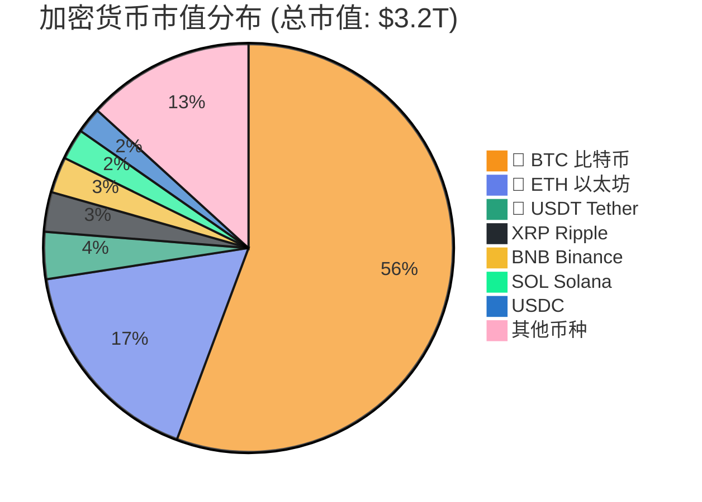

# 🪙 加密货币市场分析报告 - 2026年1月

> [!info] 执行摘要
> 2026年初，加密货币市场展现出强劲的复苏势头。**比特币**表现突出，年初至今上涨近6%，价格突破$93,000-$95,000关键阻力位。市场总市值达到**$3.24万亿**，投资者信心逐步恢复。

## 📊 核心数据

| 指标 | 数值 |
|------|------|
| 💰 **比特币价格** | $93,155 - $95,000 (1月5日) |
| 📈 **市场总市值** | $3.24万亿 |
| 🚀 **比特币年初涨幅** | ~6% |
| 😊 **市场情绪** | 从"极度恐慌"转向谨慎乐观 |
| 📊 **24小时交易量** | $377亿 |
| ⚡ **BTC波动率** | 1.1% |

---

## 🌐 一、市场概况

### 1.1 整体表现

2026年1月，加密货币市场迎来了强劲开局。[[#比特币-BTC]]连续5个交易日上涨，创下4周以来的最高水平。主要加密货币如[[#以太坊-ETH]]、[[#XRP]]、[[#Solana]]等也跟随上涨趋势。

> [!summary] 关键指标
> - **24小时波动率**: 1.1%
> - **24小时交易量**: $377亿
> - **BTC市值占比**: 保持在50%以上

### 1.2 市场驱动因素

> [!success] 积极因素
> 1. **机构资金流入**: [[ETF]]持续净流入，显示机构投资者信心增强
> 2. **技术面改善**: 比特币突破关键技术阻力位，引发技术性买盘
> 3. **宏观经济环境**: 科技股整体走强，带动风险资产偏好上升
> 4. **减半周期效应**: 尽管距离上次减半已有一段时间，但供应稀缺性仍在发挥作用

> [!warning] 风险因素
> 1. **监管不确定性**: 全球监管政策仍在发展中
> 2. **宏观经济数据**: CPI等关键经济数据可能影响美联储货币政策
> 3. **技术阻力**: 比特币在$100,000关口面临重要心理阻力

---

## 💎 二、主要加密货币分析

### 2.1 比特币 (BTC) #bitcoin

```dataview
TABLE without ID
  btc.current_status AS "当前状态",
  btc.ytd_performance AS "年初至今",
  btc.next_target AS "下一目标"
WHERE file = this.file
```

**当前状态**: $93,155 - $95,000
**年初至今**: +6%

> [!tip] 技术分析
> - ✅ 突破4周高点
> - 🎯 接近$95,000关键阻力位
> - 📈 下一目标: $100,000 - $110,000

**预测**: 多数分析师认为比特币有望在2026年测试**$100,000-$110,000**区间，但可能面临较大波动。

### 2.2 以太坊 (ETH) #ethereum

**当前趋势**: 需要突破关键价位确认趋势反转
**目标区间**: $2,900 - $3,150

> [!info] 关键因素
> - 🔗 网络升级进展
> - 💎 DeFi生态发展
> - 🏦 机构采用程度

**特别关注**: [[Neo银行]]（数字银行）预计将成为推动以太坊2026年增长的重要力量，将传统银行服务与DeFi连接。

### 2.3 主要山寨币表现

| 币种 | 表现 | 备注 |
|------|------|------|
| 🚀 [[XRP]] | +9% | 领涨山寨币，单日涨幅达9% |
| ⚡ [[Solana]] | 活跃 | 保持生态活跃度 |
| 💰 [[BNB]] | 稳定 | 稳定在市值前5 |
| 🐕 [[Dogecoin]] | 上涨 | 跟随大盘上涨 |
| 📊 [[Cardano]] | 上涨 | 跟随大盘上涨 |

---

## 🏗️ 三、市场结构分析

### 3.1 市值排名（按市值）



### 3.2 板块轮动

> [!trending] 表现突出
> - **基础设施层**: [[Base]]、[[Polymarket]]预计将发行代币并进入市值前10
> - **DeFi协议**: 通缩性DeFi协议受到关注
> - **RWA代币化**: 现实世界资产代币化成为热点

---

## 🔮 四、2026年市场预测

### 4.1 机构观点汇总

> [!quote] Bitwise预测
> 1. 比特币将打破4年周期规律，创历史新高
> 2. 比特币波动率将低于英伟达
> 3. 机构采用持续加速

> [!quote] Galaxy Digital
> - 比特币有望在2027年底达到**$250,000**
> - 2026年可能创历史新高，但市场波动性较大

> [!quote] Grayscale
> - "**机构化时代**"已经到来
> - 透明、可编程、供应稀缺的数字资产需求上升

### 4.2 关键主题

> [!abstract] 1. 机构化加速
> - 更多传统金融机构进入加密货币领域
> - ETF产品持续扩展
> - 托管和合规服务成熟

> [!abstract] 2. DeFi成熟化
> - DeFi协议与传统金融融合
> - 现实世界资产(RWA)代币化加速
> - 稳定币支付基础设施完善

> [!abstract] 3. 技术创新
> - Layer 2解决方案持续优化
> - 互操作性改善
> - 用户体验提升

> [!abstract] 4. 监管明确化
> - 主要司法管辖区监管框架逐步清晰
> - 合规成为主流
> - 投资者保护加强

---

## ⚠️ 五、风险提示

### 5.1 短期风险 #risk-management

> [!danger] 短期风险
> 1. **技术阻力**: 比特币在$100,000整数关口面临强大阻力
> 2. **获利回吐**: 短期涨幅较大可能引发抛售压力
> 3. **宏观风险**: 美联储货币政策、全球经济数据

### 5.2 中期风险

> [!caution] 中期风险
> 1. **监管不确定性**: 全球监管政策差异
> 2. **竞争加剧**: 央行数字货币(CBDC)发展
> 3. **技术风险**: 网络安全、智能合约漏洞

### 5.3 长期风险

> [!warning] 长期风险
> 1. **市场周期**: 加密货币仍处于早期阶段，周期性波动不可避免
> 2. **技术迭代**: 新技术可能颠覆现有格局
> 3. **社会接受度**: 大规模采用仍需时间

---

## 💡 六、投资建议

### 6.1 短期策略（1-3个月）

> [!todo] 谨慎乐观
> - 🎯 关注比特币能否有效突破$100,000
> - 📊 仓位控制，避免追高
> - 🔄 分散投资，关注基本面强劲的项目

### 6.2 中期策略（3-12个月）

> [!important] 重点关注
> - 🏦 机构采用趋势
> - 💎 DeFi和RWA代币化机会
> - ⚡ 技术创新项目

### 6.3 风险管理

> [!check] 核心原则
> 1. ✅ **只投资能承受损失的资金**
> 2. 🔄 **分散投资，避免单一资产风险**
> 3. ⏰ **长期持有，短期波动是常态**
> 4. 📚 **持续学习，了解项目基本面**
> 5. 🛡️ **使用合规平台，注意安全**

---

## ✅ 七、结论

2026年加密货币市场呈现出积极的发展态势。[[#bitcoin]]的强劲表现、机构资金的持续流入、以及技术的基本面改善都预示着市场可能进入新一轮上升周期。

> [!note] 投资者建议
> - **长期视角**: 关注技术发展和基本面改善
> - **风险意识**: 始终做好风险管理
> - **持续学习**: 市场变化快速，保持学习态度
> - **合规优先**: 使用合规平台，遵守当地法规

> [!disclaimer] **免责声明**
> 本报告仅供参考，不构成投资建议。加密货币投资风险较高，请在投资前进行充分研究并咨询专业顾问。

---

## 📚 数据来源

- [[CoinDesk]]
- [[Binance Research]]
- [[Bitwise Investments]]
- [[Grayscale Research]]
- [[Galaxy Digital]]
- [[The Block Research]]
- [[Finance Magnates]]
- [[CoinDCX]]

---

**报告日期**: 2026-01-06
**下次更新**: 2026-02-01
**报告版本**: v1.0

## 🔗 相关链接

- [[加密货币/历史数据/2025年12月报告|2025年12月市场分析]]
- [[加密货币/投资策略/长期持有策略]]
- [[加密货币/技术分析/比特币技术分析]]
- [[加密货币/DeFi/RWA代币化机会]]

---

## 📝 更新日志

- **2026-01-06**: 初始版本发布
- 下次更新预计: 2026-02-01
